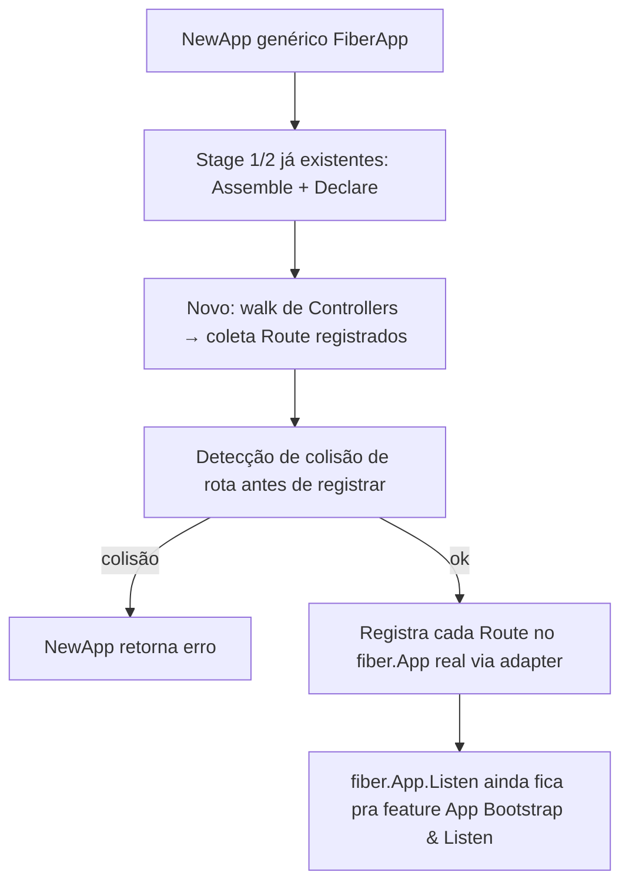

# Controller & Route Registration Design

**Spec**: `.specs/features/controller-route-registration/spec.md`
**Status**: Draft

---

## Research (Knowledge Verification Chain)

Fiber não estava no `go.mod` ainda — consultado via Context7 (`/gofiber/fiber`), confiança alta (2170+ snippets, reputação alta):

- **Versão alvo: Fiber v3** (`github.com/gofiber/fiber/v3`), não v2. V3 mudou o handler pra `func(c fiber.Ctx) error` (interface por valor, não `*fiber.Ctx` como v2) — projeto começa agora, sem motivo pra travar em v2.
- `app := fiber.New()`; `app.Get/Post/Put/Delete(path, handler)` registram rota.
- `c.Params(key string) string` devolve o param cru; existe `fiber.Params[T](c, key, default...)` genérico do próprio Fiber, mas com semântica de fallback-pra-default — **não serve pro nosso `MustParam[T]`**, que precisa panicar em vez de devolver zero-value silencioso (contrato já estabelecido no resto do framework, ver `MustInject`/`MustResolve` da feature DI Graph).
- `c.JSON(value) error`, `c.Status(code) fiber.Ctx` (chainable), `c.SendString(s) error`.
- Handler do Fiber retorna `error`; handler que panica **não vira 500 automático** a menos que o middleware `recover.New()` (`fiber/v3/middleware/recover`) esteja instalado — Fiber não recupera panic por padrão.
- **Decisão de design**: gonest **não** usa o middleware `recover` do Fiber nem o padrão `return error` do Fiber pra reportar falha. O `Handler` do `gonest.Route` (per INSIGHT.md) é `func(ctx *gonest.Context)`, sem retorno — segue o mesmo contrato de panic-como-erro já usado em todo o resto do framework (`MustInject`, `Constructor` de Provider etc). O adapter Fiber registra um wrapper `func(c fiber.Ctx) error` que roda o `Handler` do gonest dentro de um `recover()` próprio, escrevendo a resposta 500 genérica via `c.Status(500).SendString(...)` direto — nunca delega pro error-handling nativo do Fiber.

---

## Architecture Overview



Reaproveita o bootstrap já existente (Stage 1 `Module.Assemble`, Stage 2 `Provider/Controller.Declare()`, `NewApp`/`MustNewApp` de `app.go`) — essa feature adiciona um **Stage 2.5**: depois que `Controller.Declare()` roda (populando as `Route`s declaradas dentro do `fn` do Controller, igual `Provider.Constructor` é populado dentro do seu `fn`), um passo novo percorre todos os Controllers da árvore de módulos, coleta as rotas, valida colisão, e registra no adapter HTTP real.

`NewApp[T]` já é genérico no design original (`gonest.NewApp[gonest.FiberApp](AppModule)`, INSIGHT.md) mas T9 implementou só a versão não-genérica (sem adapter HTTP, só resolve o grafo DI). Essa feature introduz o type param de verdade: `FiberApp` é o (único, por ora) adapter que satisfaz uma interface `httpAdapter` mínima (`RegisterRoute(method, path, handler)`, `Listen(addr) error` — `Listen` só usado pela feature seguinte).

---

## Code Reuse Analysis

### Existing Components to Leverage

| Component | Location | How to Use |
| --- | --- | --- |
| `Controller` (shell) | `internal/controller/controller.go` | Estende com `Path`/`Route`/`Use`/`Guards`/`Interceptors`/`Filters` — mesmo tipo, novos métodos |
| `Module.OwnControllers()` | `internal/module/module.go` | Já existe (T9/T10), usado pra percorrer controllers na hora de coletar rotas |
| `Controller.Declare()` | `internal/controller/controller.go` (T9) | Já roda o `fn` adiado — `Path`/`Route` são chamados de dentro desse `fn`, mesmo padrão de `Provider.Constructor` |
| `NewApp`/`MustNewApp` | `app.go` (T9) | Estendido pra genérico `NewApp[T HttpAdapter]`, adiciona a fase de registro de rota depois do Stage 2.5 |
| `scope`/`module`/`provider` packages | `internal/*` | Sem mudança — só consumidos |

### Integration Points

| Sistema | Como integra |
| --- | --- |
| `github.com/gofiber/fiber/v3` | Novo dependency direto (`go get`). Único ponto de contato: `internal/fiberapp` (adapter) — nenhum outro pacote importa Fiber diretamente |
| `reflect` | `MustParam[T]` usa reflect+strconv pra coerção default, mesmo padrão de `MustInject[T]` (validação de tipo via reflect, não builder genérico complexo) |

---

## Components

### Route (declaração de rota)

- **Purpose**: representa 1 rota HTTP — método, path, status default, handler, params customizados com Pipe.
- **Location**: `internal/route/route.go` (pacote novo, segue AD-004: 1 pacote por tipo)
- **Interfaces**:
  - `route.New(method HttpMethod, path string, fn func(*Route)) *Route` — mesmo padrão de fn adiado, executado quando `Controller.Route(...)` roda dentro do `fn` já adiado do Controller (aninhamento de adiamento: Controller.Declare() → roda fn do controller → chama `controller.Route(...)` → esse por sua vez cria+roda o fn do Route imediatamente, já que nesse ponto tudo já é conhecido, diferente do Provider/Controller que precisam esperar Stage 1)
  - `(r *Route) HttpCode(status int)`
  - `(r *Route) Param(name string, p *pipe.Pipe)` — registra Pipe customizado pro param
  - `(r *Route) Handler(fn func(ctx *Context))`
- **Dependencies**: `internal/pipe` (tipo `*pipe.Pipe`), `internal/httpctx` (tipo `*Context`)
- **Reuses**: nada de DI — é puramente declarativo, populado dentro do `fn` já resolvido do Controller

### Controller (estendido)

- **Purpose**: adiciona `Path`/`Route`/`Use`/`Guards`/`Interceptors`/`Filters` ao shell já existente de T9.
- **Location**: `internal/controller/controller.go` (arquivo existente, adiciona campos/métodos — não cria pacote novo)
- **Interfaces novas**:
  - `(c *Controller) Path(prefix string)`
  - `(c *Controller) Route(method HttpMethod, path string, fn func(*route.Route))` — cria o `*route.Route`, roda seu `fn` imediatamente (motivo: dentro do `fn` do Controller — já em Stage 2, módulo já resolvido — não precisa de mais um estágio de adiamento), guarda na lista interna de rotas do Controller
  - `(c *Controller) Use(m ...Middleware)`, `Guards(g ...Guard)`, `Interceptors(i ...Interceptor)`, `Filters(f ...Filter)` — **stubs**: `Middleware`/`Guard`/`Interceptor`/`Filter` são tipos placeholder mínimos (`type Middleware struct{}` ou interface vazia — decisão de implementação, não bloqueia esta feature), métodos só armazenam numa slice, nada lê essa slice ainda
  - `(c *Controller) OwnRoutes() []*route.Route` — accessor exportado (padrão já usado em Module/Provider), consumido pelo passo novo de "Stage 2.5" em `app.go`
- **Dependencies**: `internal/route`
- **Reuses**: `Declare()` já existente (T9) — `Path`/`Route` são só mais chamadas dentro do mesmo `fn` que já roda uma vez

### Context (novo)

- **Purpose**: encapsula a request/response HTTP; ponto único de acesso pro Handler de uma rota.
- **Location**: `internal/httpctx/context.go` (pacote novo)
- **Interfaces**:
  - `(ctx *Context) Json(value any)` — `ctx.fiberCtx.JSON(value)` por dentro
  - `(ctx *Context) Status(code int) *Context` — chainable, seta status antes do body
  - `(ctx *Context) Header(name string) string` / `SetHeader(name, value string)`
  - `(ctx *Context) Param(name string) string` — acesso cru, usado internamente por `MustParam[T]`
- **Dependencies**: `github.com/gofiber/fiber/v3` (único outro ponto de contato com Fiber além do adapter)
- **Reuses**: nada

### Pipe (novo, mínimo)

- **Purpose**: transforma um param string bruto no tipo pedido, ou panica.
- **Location**: `internal/pipe/pipe.go` (pacote novo)
- **Interfaces**:
  - `pipe.New(fn func(*Pipe)) *Pipe` — mesmo padrão de fn adiado
  - `(p *Pipe) Handler(fn any)` — reflect-valida a assinatura `func(ctx *httpctx.Context, raw string) T` (T qualquer), guarda via reflect, mesmo mecanismo de validação que `Provider.Constructor` já usa
- **Dependencies**: `internal/httpctx` (tipo `*Context` passado pro Handler)
- **Reuses**: padrão de validação de assinatura via reflect já usado em `internal/provider/provider.go`'s `isValidConstructorSignature`

### MustParam[T] (genérico público)

- **Purpose**: ponto único de acesso a param tipado dentro de um Handler de rota.
- **Location**: `internal/route/param.go` (mesmo pacote de Route, já que resolve contra a `*Route` atual pra saber se tem Pipe customizado) + `param.go` na raiz (wrapper genérico público, mesmo padrão de `MustInject[T]` — Go não permite reexportar função genérica via `var`)
- **Interfaces**:
  - `MustParam[T any](ctx *Context, name string) T`
- **Dependencies**: `internal/pipe` (se a rota atual tiver Pipe customizado pro param), reflect+strconv (coerção default caso não tenha)
- **Reuses**: mesmo padrão de panic-claro de `MustInject`

### FiberApp (adapter)

- **Purpose**: implementa o contrato mínimo que `NewApp[T]` precisa pra registrar rotas — único pacote que importa Fiber além de `internal/httpctx`.
- **Location**: `internal/fiberapp/fiberapp.go` (pacote novo)
- **Interfaces**:
  - `type FiberApp struct { app *fiber.App }` — satisfaz um contrato interno `httpAdapter` (`RegisterRoute(method, path string, h func(*httpctx.Context)) error`, `Listen(addr string) error`)
- **Dependencies**: `github.com/gofiber/fiber/v3`, `internal/httpctx`
- **Reuses**: nada — é o ponto de entrada que traduz `gonest.Route`/`gonest.Context` pro mundo Fiber

### NewApp[T] (estendido)

- **Purpose**: `app.go` na raiz — vira genérico de verdade, adiciona Stage 2.5 (coleta+registro de rota) depois do Stage 2 (Declare) já existente.
- **Location**: `app.go` (arquivo existente, estendido)
- **Interfaces**:
  - `NewApp[T HttpAdapter](root *Module) (*App, error)` / `MustNewApp[T HttpAdapter](root *Module) *App` — `T` agora carrega o adapter real (`gonest.FiberApp`)
- **Dependencies**: `internal/fiberapp`, `internal/route` (pra detecção de colisão), tudo que T9 já usa
- **Reuses**: Stage 1 (`Assemble`)/Stage 2 (`Declare`)/Stage 3 (resolução DI) inteiros, sem mudança — só adiciona o passo novo entre Stage 2 e Stage 3 (ou depois de Stage 3, já que rota não depende de resolução DI ter terminado — só depende de `Declare()` ter rodado, que já é verdade antes de Stage 3 começar)

---

## Data Models

Não há modelo persistido — só estrutura declarativa:

```go
type Route struct {
    method     HttpMethod
    path       string
    httpCode   int // default 200, sobrescrito por HttpCode()
    handler    func(ctx *Context)
    paramPipes map[string]*pipe.Pipe // name -> Pipe customizado, senão coerção default
}
```

**Relationships**: `Controller.routes []*Route` (populadas dentro do `fn` já adiado do Controller); `NewApp`'s Stage 2.5 percorre `Module.OwnControllers()` recursivamente pela árvore assembleada (mesmo BFS que Stage 1 já fez, reaproveitando a lista de módulos visitados que `Assemble()` já devolve) e chama `Controller.OwnRoutes()` em cada um, montando o prefixo completo (`Controller.Path() + Route.path`).

---

## Error Handling Strategy

| Cenário | Tratamento | Impacto pro dev |
| --- | --- | --- |
| Handler panica com algo não-Exception (Milestone 2 não existe ainda) | `recover()` no wrapper do adapter Fiber, responde `500` com body genérico (`c.Status(500).SendString("Internal Server Error")`) | Nunca crasha o processo; sem detalhe vazado |
| `MustParam[T]` com valor que não converte | panic com mensagem clara (`"gonest: param %q could not be converted to %s: %v"`) — cai no mesmo recover acima, vira 500 por enquanto (Milestone 2 vai mapear pra 400 estruturado) | Erro visível nos logs, resposta genérica até Milestone 2 |
| `MustParam[T]` com `name` que não existe na rota | panic com mensagem clara distinta (`"gonest: no param named %q on this route"`) — mesmo caminho de recover | Idem acima |
| Colisão de rota (método+path duplicado, considerando prefixo) | detectada em Stage 2.5, antes de registrar no Fiber — `NewApp` retorna erro `"duplicate route: GET /user/:id"` | Erro de bootstrap, servidor não sobe (igual comportamento de provider duplicado no DI Graph) |
| `Pipe.Handler` com assinatura inválida | panic em tempo de declaração (Stage 2, dentro do `fn` do Pipe) — mesmo padrão de `Provider.Constructor` | Erro descoberto cedo, antes do servidor subir |

---

## Tech Decisions (only non-obvious ones)

| Decisão | Escolha | Racional |
| --- | --- | --- |
| Versão do Fiber | v3 (`gofiber/fiber/v3`), não v2 | Handler `func(c fiber.Ctx) error` (não-pointer) é a API atual; projeto novo, sem razão de travar em v2. Confirmado via Context7 |
| Recover de panic | Recover próprio do gonest no wrapper do adapter, não o middleware `recover` nativo do Fiber | `Handler` do gonest não segue o contrato `func(fiber.Ctx) error` — é `func(ctx *gonest.Context)`, sem retorno, panic-como-erro (consistente com `Constructor`/`MustInject` do resto do framework) |
| Onde `Route`/`MustParam[T]` vivem | pacote `internal/route`, não dentro de `internal/controller` | Route é conceito próprio (T2/T3/T4 do DI Graph já estabeleceram "1 pacote por tipo", AD-004) — Controller só guarda `[]*route.Route` |
| Registro de rota | Stage 2.5 novo em `app.go`, não dentro de `Controller.Declare()` | `Controller.Declare()` só popula a struct em memória (mesmo papel de `Provider.Constructor` ser só *registrado*, não *invocado*, em Stage 2) — registrar no Fiber de verdade é efeito colateral que só faz sentido depois que TODOS os controllers da árvore rodaram `Declare()` (pra detectar colisão cross-module antes de tocar no Fiber) |
| `MustParam[T]` coerção default | reflect+strconv pros tipos básicos, function própria (não reusa `MustInject`'s placeholder mechanism — são conceitos diferentes: DI resolve referência, Param converte valor) | Nenhuma relação com o grafo de DI — é conversão de string pra tipo primitivo, mecanismo mais simples que justifica não reusar `internal/inject` |

---

## Open Questions pra Tasks

- `HttpMethod` (enum `HttpGet`/`HttpPost`/etc, já usado em várias partes do INSIGHT.md) precisa existir — checar se cabe em `internal/route` ou merece pacote próprio (provavelmente cabe em `internal/route`, é pequeno).
- `Middleware`/`Guard`/`Interceptor`/`Filter` (tipos placeholder do P3) — decisão de forma exata (struct vazio vs interface) fica pra Tasks, não acho que precisa de gray area aqui, é baixo risco por ser puro no-op.
