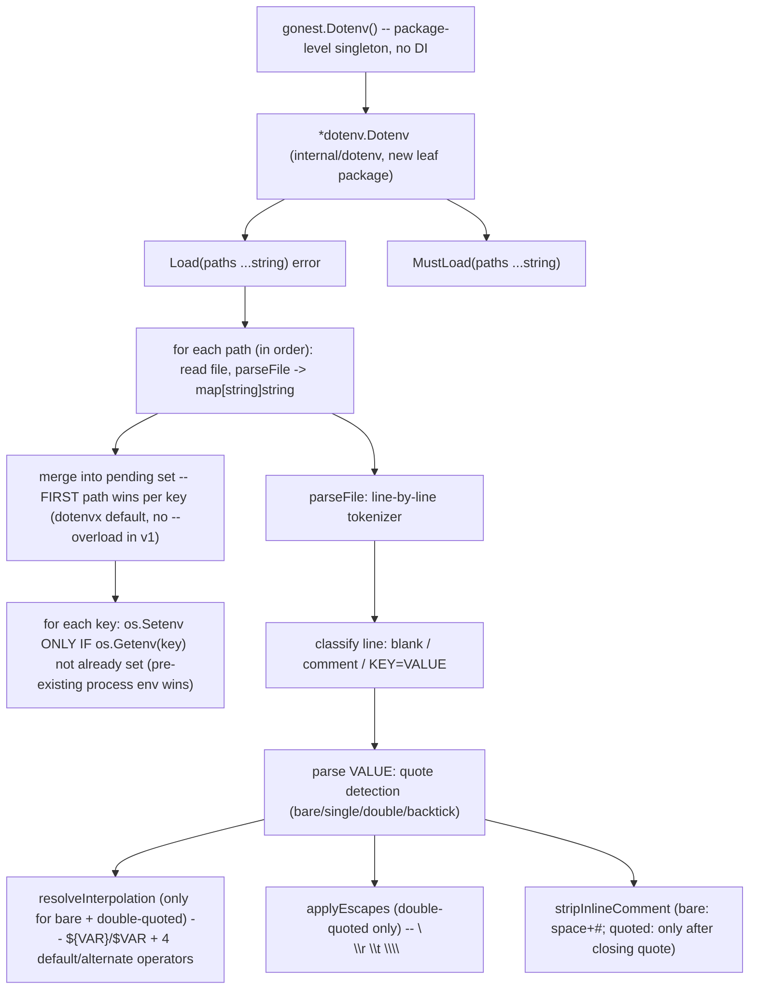

# Dotenv Loading Design

**Spec**: `.specs/features/dotenv-loading/spec.md`
**Context**: `.specs/features/dotenv-loading/context.md`
**Status**: Complete

---

## Architecture Overview

Everything in this feature is new (`internal/dotenv` doesn't exist yet) -- no reuse from elsewhere in
gonest, since nothing today touches `.env` files or `os.Environ()`. `gonest.Dotenv()`'s only
integration point with the rest of the framework is that it must be safely callable from `main()`
before any `Module`/`Provider`/`NewApp` exists -- confirmed by NOT depending on `internal/inject`/
`internal/module`/DI machinery at all.

---

## Open Edge Cases Resolved (spec.md left these to Design)

| Edge Case (spec.md) | Resolution | Source |
| -------------------- | ---------- | ------ |
| Precedence between multiple `Load(paths...)` | **First path wins** per key -- a key already set by an earlier path (or already present in `os.Environ()` before `Load` runs) is NOT overwritten by a later path. Matches `dotenvx run -f a -f b`'s own documented default (confirmed via `WebSearch`, not assumed) -- "the first `-f` will 'win'... subsequent files do NOT override pre-existing variables". No `--overload`-equivalent flag in v1 (YAGNI -- add later if a real need surfaces) | `dotenvx run` CLI reference, `dotenvx.com/docs/advanced/run-environment-variable-precedence` |
| File vs. pre-existing `os.Environ()` | Pre-existing process env ALWAYS wins over any file value -- same "first wins" rule applied transitively (the process's own env is conceptually loaded "before" any file) | Same source -- "historic dotenv principle where existing values take priority by default" |
| Malformed line (no `=`, not blank, not a comment) | `Load` returns a descriptive error immediately (`"gonest: malformed line N in <path>: <raw line>"`), stopping that file's parse -- fail loud, matches this codebase's own established preference (AD-025's `fiberMethod` fix rejected a silent fallback for the same reason) | This codebase's own convention (STATE.md AD-025) |
| `${VAR}` referencing a never-defined variable (no default operator) | Expands to empty string -- standard shell/dotenv behavior, not an error | spec.md's own Edge Cases section already states this; confirmed consistent with POSIX parameter expansion `${VAR}` (undefined = empty, only `${VAR?}` errors, which this feature doesn't implement) |

---

## Components

### `internal/dotenv.Dotenv` (new package)

- **Purpose**: The singleton type `gonest.Dotenv()` returns -- owns `Load`/`MustLoad` (this feature)
  and, in the sibling feature `env-schema-binding`, gains `ParseInto` to satisfy
  `execution.Parseable`. Kept as ONE type across both features per `context.md`'s D2.
- **Location**: `internal/dotenv/dotenv.go`
- **Interfaces**:
  - `Get() *Dotenv` -- returns the package-level singleton (a `var instance = &Dotenv{}` at package
    scope, lazily nothing-to-init since `Dotenv` has no required setup). NOT a constructor a caller
    invokes (`New()`-style) -- there is exactly one, framework-owned, matching `gonest.Dotenv()`'s
    call shape (`gonest.Dotenv().Load(...)`, not `gonest.NewDotenv().Load(...)`).
  - `(*Dotenv) Load(paths ...string) error` -- for each path IN ORDER: read the file (`os.ReadFile`),
    `parseFile` it into an ordered `map[string]string` (values already fully resolved: quotes
    stripped, interpolation/escapes applied), then `os.Setenv` each key ONLY if `os.LookupEnv(key)`
    reports absent (enforces "first/pre-existing wins" across BOTH multiple paths and the pre-existing
    process env, since paths are processed in order and each `Setenv` immediately makes that key
    "already set" for the next path's check). A path that doesn't exist: `os.ReadFile`'s own
    `*PathError` propagates up wrapped (`"gonest: dotenv load %q: %w"`), per spec.md P1 AC3.
  - `(*Dotenv) MustLoad(paths ...string)` -- calls `Load`, panics on any error. Same "Must-prefixed
    panics" convention as `MustParse`/`MustNewApp`/etc. across the whole framework.
- **Dependencies**: none beyond stdlib (`os`, `bufio`/`strings`) -- deliberately zero framework
  dependency, so it stays callable before any bootstrap machinery exists.
- **Reuses**: nothing (genuinely new capability) -- see Architecture Overview for why.

### `parseFile` (internal, `internal/dotenv/parse.go`)

- **Purpose**: Turn one `.env` file's raw bytes into an ordered `[]envPair{Key, Value string}` slice
  (order preserved -- needed since interpolation can reference a key defined earlier in the SAME
  file, per spec.md P1 AC4: "`${VAR}` referencia uma variável já resolvida ANTES na mesma carga").
- **Line classification** (first non-whitespace character(s) of the line, after trimming leading
  whitespace only -- trailing whitespace handling is part of value-parsing, not classification):
  - Empty (after trim) → skip (spec.md's "Linhas em branco são ignoradas")
  - Starts with `#` → skip (whole-line comment)
  - Otherwise → must contain `=`; the part before the FIRST `=` (trimmed) is the key, the rest is the
    raw value expression to hand to `parseValue`
- **`parseValue(raw string, resolved map[string]string) (value string, err error)`**: dispatches by
  the value's OPENING character:
  - `` ` `` (backtick) → multiline mode: consume raw file lines (already available, since `parseFile`
    reads the whole file up front, not line-by-line streaming) until the CLOSING backtick, preserving
    real `\n` between the consumed lines; no interpolation, no escape processing (dotenvx's own
    backtick block is presented as literal text spanning lines, distinct from the escape-sequence
    handling of double-quoted values)
  - `'` (single quote) → read until the matching unescaped `'`; NO interpolation; `\'` inside is a
    literal `'` (spec.md P1 AC3 + P2 AC6's escaped-quote rule)
  - `"` (double quote) → read until the matching unescaped `"`; interpolation AND escape sequences
    (`\n`/`\r`/`\t`/`\\`) both apply, in that order (escapes resolved first on the raw quoted content,
    THEN interpolation on the escape-resolved string -- avoids a literal `\$` being misread as an
    interpolation trigger, though `\$` itself isn't a documented dotenvx escape and is out of scope)
  - anything else (bare/unquoted) → read until an unescaped inline-comment trigger (a ` #` -- space
    then hash) or end of line, whichever comes first; interpolation applies, no backslash-escape
    processing (bare values don't support `\n` etc per dotenvx -- only double-quoted do)
- **`resolveInterpolation(s string, resolved map[string]string) string`**: scans for `$VAR`/`${VAR}`/
  `${VAR:-default}`/`${VAR-default}`/`${VAR:+alt}`/`${VAR+alt}` (regex or hand-rolled scanner, decided
  in Tasks), looking each `VAR` up first in `resolved` (keys already parsed earlier in the SAME file,
  per AC4) and falling back to `os.Getenv(VAR)` (a key from a PREVIOUS `Load` path, or the real
  process env) if not found in `resolved` -- undefined (neither) resolves per the operator (`:-`/`-`
  default value; bare `$VAR`/`${VAR}` with nothing found → empty string).
- **Dependencies**: none beyond stdlib.
- **Reuses**: nothing.

---

## Tech Decisions

| Decision | Choice | Rationale |
| -------- | ------ | --------- |
| Parser implementation: hand-rolled vs. regex-heavy vs. a parser-combinator style | Hand-rolled character scanner (a `parseValue` per quote-style, explicit index-walking) -- exact style TBD in Tasks, but NOT a single giant regex for the whole line, since interpolation needs to happen AFTER quote/escape resolution, and backtick multiline needs raw multi-line lookahead a single-line regex can't do cleanly | Matches the layered structure spec.md's acceptance criteria already impose (classify → dequote → escape → interpolate, each a distinct pass) |
| `Dotenv` as a struct with methods vs. free functions (`dotenv.Load(...)`) | Struct + methods, even though `Dotenv` has no fields yet in this feature | `context.md`'s D2 -- the SAME type gains `ParseInto` in the sibling feature; a free-function API now would have to become a struct later anyway, breaking the "single instance, two capabilities" design already committed to |
| Where the singleton lives (`internal/dotenv` package var vs. `gonest.go`-level var) | Package-level singleton inside `internal/dotenv`, `gonest.Dotenv()` is a thin one-line wrapper returning it | Matches every other root re-export in `gonest.go` (thin wrapper calling into `internal/*`) -- no reason for this one to differ |
| Malformed-line behavior | Fail loud (return error), not silently skip | See "Open Edge Cases Resolved" table above |

---

## Error Handling Strategy

| Error Scenario | Handling | Caller Sees |
| --------------- | -------- | ----------- |
| A `Load` path doesn't exist | `os.ReadFile`'s error wrapped and returned | `Load` returns non-nil `error`; `MustLoad` panics |
| Malformed line (no `=`) | `Load` returns immediately with a descriptive error identifying the file+line number | Same as above -- caller decides whether to `panic` (`MustLoad`) or handle (`Load`) |
| Unterminated quote/backtick (opening `"`/`'`/`` ` `` with no matching close before EOF) | `Load` returns a descriptive parse error, same file+line-number shape as the malformed-line case | Same |
| `${VAR}` with no default operator and `VAR` undefined everywhere (this file so far, `os.Environ()`) | Resolves to empty string -- NOT an error | Silent, matches spec.md's own Edge Case + POSIX `${VAR}` semantics |

---

## Traceability to Spec

| Requirement ID | Design Component |
| -------------- | ----------------- |
| DOTENV-01 | `Dotenv.Load`/`MustLoad`, `parseFile` |
| DOTENV-02 | `parseValue`'s inline-comment stripping (bare vs. quoted rule) |
| DOTENV-03 | `parseValue`'s quote-style dispatch (single vs. double vs. bare), `resolveInterpolation` |
| DOTENV-04 | `resolveInterpolation`'s 4 default/alternate operators |
| DOTENV-05 | `parseValue`'s backtick branch |
| DOTENV-06 | `parseValue`'s double-quote escape handling |
