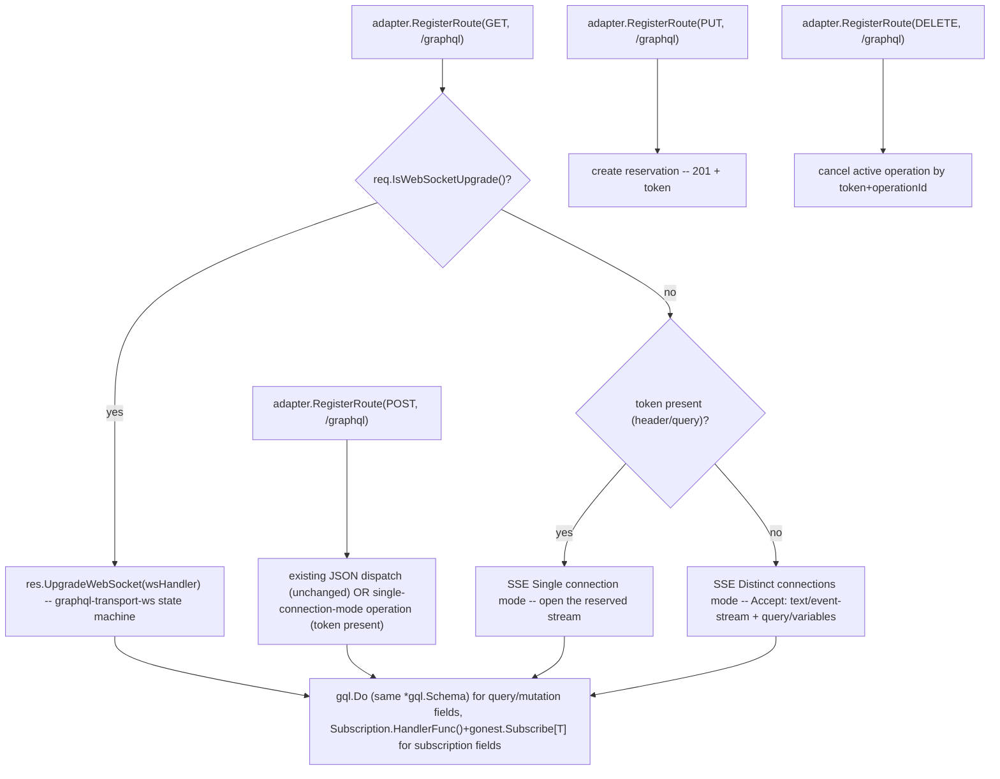

# GraphQL Realtime Protocols Design

**Spec**: `.specs/features/graphql-realtime-protocols/spec.md`
**Context**: `.specs/features/graphql-realtime-protocols/context.md`
**Status**: Complete

---

## Architecture Overview

Every transport (WS, SSE distinct, SSE single) is a thin protocol/framing layer around the
SAME two primitives Milestone 17 already built: `gql.Do(gql.Params{Schema: sch, ...})` for
single-result operations (query/mutation) and `Subscription.HandlerFunc()` + `gonest.Subscribe[T]`
for streaming operations. No new schema-building or dispatch logic — only new framing/state-machine
code per protocol, plus one new adapter capability (below) that removes the routing collision.

---

## Central Decision: Removing the `/graphql` Routing Collision

**Problem (spec.md Edge Case, unresolved on purpose until Design):** today's `RegisterWebSocket`
(`internal/adapter/fiber/fiber.go`) registers `app.Use(path, func(c) { if
websocket.IsWebSocketUpgrade(c) { return c.Next() }; return fiber.ErrUpgradeRequired })` followed by
`app.Get(path, websocket.New(...))`. Fiber's `Use` matches **every HTTP method** reaching that path
prefix, unconditionally. If `POST /graphql` (ordinary JSON dispatch) and `GET /graphql` (WS upgrade)
share the same path, the `Use` middleware intercepts the `POST` too, sees no `Upgrade` header, and
returns `426 Upgrade Required` — before the request ever reaches the real `POST` handler registered
via `RegisterRoute`. Milestone 17 avoided this by using separate ad-hoc paths (`/graphql/ws/:name`);
this feature explicitly requires the SAME `/graphql` for all four methods, so the collision is real
and must be resolved, not sidestepped.

**Decision:** remove `HttpAdapter.RegisterWebSocket` entirely. WebSocket upgrade becomes a
capability of the ordinary `Response`, invoked *from inside* a normal `GET /graphql` handler
registered the usual way via `RegisterRoute(HttpGet, path, handler)` — the same mechanism every
other route already uses, so no `app.Use` is registered at all, and `POST`/`PUT`/`DELETE`/`GET`
route on `/graphql` exactly like any other multi-method path in the framework (Fiber's `Add`/`Get`
already dispatch by method correctly today, per T1's own `fiberMethod` switch — that machinery is
untouched).

- `execution.Request` gains `IsWebSocketUpgrade() bool` (delegates to a new `Responder`-side check,
  mirrors how `GetMethod()`/`GetPath()` already expose adapter facts to the framework layer).
- `execution.Response` gains `UpgradeWebSocket(h func(conn WSConn)) error` (mirrors the existing
  `Stream(fn func(w *bufio.Writer))` capability that already lets a normal handler opt into
  long-lived I/O — `WriteStream`/`UpgradeWebSocket` are siblings on `Responder`).
- `execution.WSConn` (new, moved from `internal/graphql.WSConn` — see below) is the minimal
  connection contract (`ReadMessage`/`WriteMessage`/`Close`/`CloseWithCode`/`Params`/`Query`),
  living in `execution` because BOTH `execution.Response.UpgradeWebSocket` (the capability) and
  `internal/graphql` (the state machines that consume it) need to name the type, and only
  `graphql → execution` is a valid import direction (same reasoning as `FormFile`'s AD-029 move).
  `CloseWithCode(code int, reason string) error` is a genuinely new method on the contract --
  Milestone 17's `WSConn` only had a bare `Close()`, insufficient for `graphql-transport-ws`'s
  mandatory non-1000 close codes (4400/4401/4408/4409/4429).
- `internal/adapter/fiber.fiberResponder.UpgradeWebSocket` implementation: `return
  websocket.New(func(c *websocket.Conn) { h(&fiberWSConn{c: c}) })(f.c)` -- `websocket.New` returns
  an ordinary `fiber.Handler` (`func(fiber.Ctx) error`), callable synchronously with the CURRENT
  `fiber.Ctx` from inside another handler; this is what makes inlining the upgrade check possible
  without a separate route registration. Confirmed real via the same `github.com/gofiber/contrib/v3/
  websocket` package Milestone 17 already vendored (no new dependency).
- `internal/app/graphql.go`'s `registerGraphql` registers exactly ONE handler per method
  (`POST`/`PUT`/`GET`/`DELETE`) on `graphqlPath`, all via the ordinary `adapter.RegisterRoute` --
  the `GET` handler is the only one that branches on `req.IsWebSocketUpgrade()` first.

**Trade-off:** `HttpAdapter` shrinks by one method (`RegisterWebSocket`) and `Responder` gains one
(`UpgradeWebSocket`) -- an internal, non-breaking-to-public-API change (same category as AD-022).
Every fake `Responder`/adapter used in tests gains one method, same mechanical cost every previous
`Responder` expansion has had (AD-024, Milestone 12).

---

## Code Reuse Analysis

### Existing Components to Leverage

| Component | Location | How to Use |
| --------- | -------- | ---------- |
| `graphql.Build`'s `*gql.Schema` | `internal/graphql/generate.go` | Unchanged -- both WS single-result operations and SSE (both modes) call `gql.Do(gql.Params{Schema: sch, RequestString, VariableValues, OperationName})`, identical to today's `POST /graphql` handler |
| `Subscription.HandlerFunc()` / `gonest.Subscribe[T]` | `internal/graphql/subscription.go`, `internal/emitter` | Unchanged -- every streaming operation (WS `Subscribe` resolving to a Subscription field, SSE distinct-mode Subscription, SSE single-mode Subscription) invokes the SAME handler signature `func(ctx *GraphqlContext, emit func(any))` |
| `execution.Response.Stream`/`Responder.WriteStream` | `internal/execution/response.go`, `internal/adapter/fiber/fiber.go` | Reused unchanged for BOTH SSE modes (distinct connection response body IS the event stream; single connection's `GET` response body IS the event stream) |
| `adapter.RegisterRoute` (Stage 2.5) | `internal/app/app.go` | All 4 methods (`POST`/`PUT`/`GET`/`DELETE`) on `/graphql` register through this SAME existing mechanism -- no Stage 2.5 change needed beyond `registerGraphql`'s own body |
| `GraphqlContext.Args()`/`gonest.MustParse[T]` | `internal/graphql/context.go` | Args validation for operations dispatched via WS/SSE is identical to `POST /graphql`'s today -- same `execution.Parseable` plumbing, no duplication |
| `github.com/gofiber/contrib/v3/websocket` | already vendored (Milestone 17) | `websocket.New`, `websocket.IsWebSocketUpgrade` -- no new dependency, just a new call site (inline instead of via `app.Use`+`app.Get`) |

### Integration Points

| System | Integration Method |
| ------ | ------------------- |
| `internal/execution` | Gains `Request.IsWebSocketUpgrade() bool`, `Response.UpgradeWebSocket(h func(WSConn)) error`, `WSConn` interface (moved from `internal/graphql`, extended with `CloseWithCode`) |
| `internal/adapter/fiber` | `fiberResponder` implements `UpgradeWebSocket`; `fiberWSConn` implements `CloseWithCode` via the underlying `*websocket.Conn`'s `WriteControl(gorilla_websocket.CloseMessage, gorilla_websocket.FormatCloseMessage(code, reason), ...)`; `HttpAdapter.RegisterWebSocket` REMOVED |
| `internal/app/graphql.go` | `registerGraphql` rewritten: 4 `RegisterRoute` calls (`POST`/`PUT`/`GET`/`DELETE`) on the same `graphqlPath`, replacing today's 3-call ad-hoc registration (`POST` + conditional SSE `GET .../stream/:name` + `RegisterWebSocket .../ws/:name`) |
| `internal/graphql` | New files: `wsprotocol.go` (WS state machine), `ssedistinct.go` (Distinct connections mode), `ssesingle.go` (Single connection mode + reservation registry), `wsconn_alias.go` (`type WSConn = execution.WSConn`, keeps existing call sites inside the package compiling). REMOVED: `ws.go`, `sse.go` (ad-hoc handlers), their tests |

---

## Components

### WebSocket -- `graphql-transport-ws` state machine (new -- `internal/graphql/wsprotocol.go`)

- **Purpose**: Per-connection state machine implementing the real protocol (`ConnectionInit`/
  `ConnectionAck`/`Ping`/`Pong`/`Subscribe`/`Next`/`Error`/`Complete`), multiplexed by `id`.
- **Location**: `internal/graphql/wsprotocol.go`
- **Interfaces**: `WSHandler(sch *gql.Schema, subs map[string]*Subscription) func(conn WSConn)` --
  same call-site shape `registerGraphql` already uses today, so `internal/app/graphql.go`'s wiring
  stays a one-line swap.
- **Internal shape**: `type wsConnState struct { acked bool; initDeadline *time.Timer; mu sync.Mutex;
  ops map[string]context.CancelFunc }`. One `wsConnState` per accepted connection (created inside the
  handler closure, not shared). Read loop: `conn.ReadMessage()` in a `for` loop (mirrors Milestone
  17's `WSHandler`'s existing blocking-read-detects-disconnect pattern, ver AD-036) -- each message is
  JSON-decoded into `{type string; id string; payload json.RawMessage}` and dispatched by `type`.
- **Message handling**:
  - `connection_init`: if `acked` already true → close `4429`; otherwise start `initDeadline`
    (already fired = too late, close `4408` if it already elapsed), set `acked = true`, write
    `connection_ack`.
  - Any message before `connection_ack` other than `connection_init` → close `4401`.
  - `ping` → write `pong` (no payload requirement enforced, per Out of Scope -- no server-initiated
    ping in v1).
  - `pong` → no-op (server never sends unsolicited `ping` in v1, but must not error if a client sends
    an unsolicited `pong`).
  - `subscribe {id, payload:{query, variables, operationName}}`: if `id` already in `ops` → close
    `4409`. Parse the GraphQL document (reuse `gql.Parse` err handling the SAME way the existing
    `POST /graphql` handler already does before calling `gql.Do`). Look up the requested field name
    against `subs` (registered Subscriptions) -- if found, spawn a goroutine calling
    `sub.HandlerFunc()(gqlCtx, emit)` where `emit` writes `next {id, payload:{data:{...}}}` per value
    and `gqlCtx.Done()` is wired to a `context.CancelFunc` stored in `ops[id]`; on natural handler
    return or explicit `Complete{id}`/connection close, write `complete {id}` and remove from `ops`.
    If NOT a registered Subscription, treat it as a single-result operation: call `gql.Do` on the
    SAME `*gql.Schema` used by `POST /graphql`, write exactly one `next {id, payload: result}`
    followed immediately by `complete {id}`.
  - `complete {id}`: cancel `ops[id]` (via its `context.CancelFunc`) if present, remove from map; not
    an error if `id` is unknown (client may race a natural completion).
  - Unknown `type`, or malformed JSON → close `4400`.
  - Connection close (read error from `conn.ReadMessage()`): cancel every `context.CancelFunc` still
    in `ops` (stops every active Subscription for that connection -- satisfies P1's 3rd acceptance
    criterion).
- **Dependencies**: `internal/graphql` (`Query`/`Mutation`/`Subscription`/`GraphqlContext`),
  `execution.WSConn`, `github.com/graphql-go/graphql` (`gql.Do`, `gql.Parse` for early syntax
  validation before dispatch).
- **Reuses**: `gql.Do`, `Subscription.HandlerFunc()`, `gonest.Subscribe[T]` -- zero new dispatch
  logic, only new framing.

### SSE -- Distinct connections mode (new -- `internal/graphql/ssedistinct.go`)

- **Purpose**: `GET /graphql` with `Accept: text/event-stream` and NO reservation token -- one
  connection, one operation, per `graphql-sse` PROTOCOL.md's simpler mode.
- **Location**: `internal/graphql/ssedistinct.go`
- **Interfaces**: `SSEDistinctHandler(sch *gql.Schema, subs map[string]*Subscription) func(req
  *execution.Request, res *execution.Response)`.
- **Behavior**: reads `query`/`variables`/`operationName` from the query string (GraphQL-over-HTTP
  `GET` convention -- same shape `POST /graphql`'s JSON body already carries, just query-string
  encoded). If the requested field is a registered Subscription, calls `res.Stream(...)` and forwards
  every `emit(value)` as an SSE `event: next` (`data: {"data": value}`), never closing until the
  handler returns or the connection drops; otherwise runs `gql.Do` once and writes a single `next` +
  `complete` pair before returning (closing the connection naturally). A validation error BEFORE
  execution (bad query syntax, unknown field, arg validation failure) is written as a `next` event
  carrying `{"errors":[...]}` in `data` -- never a bare HTTP 4xx (spec.md AC3, `EventSource`'s own
  limitation of not exposing a non-200 body).
- **Dependencies**: same as WS component, minus WSConn (SSE reuses `execution.Response.Stream`
  directly).
- **Reuses**: `gql.Do`, `Subscription.HandlerFunc()`.

### SSE -- Single connection mode (new -- `internal/graphql/ssesingle.go`)

- **Purpose**: `PUT`(reserve) → `GET`(open, token-bound) → `POST`(execute, token+`operationId`) →
  `DELETE`(cancel, token+`operationId`) -- the multiplexed mode, per D7/context.md.
- **Location**: `internal/graphql/ssesingle.go`
- **Interfaces**:
  - `SSEReserveHandler() func(req, res)` -- `PUT`, generates a token (`crypto/rand`-backed, same
    rigor as any other opaque token in the stdlib idiom -- NOT `math/rand`), stores a `*reservation`
    in the registry, responds `201` with `{"token": "..."}`.
  - `SSEConnectHandler(reg *reservationRegistry) func(req, res)` -- `GET` with token (header
    `X-GraphQL-Event-Stream-Token` or query `token`), looks up the reservation, calls `res.Stream`
    binding that connection's writer to the reservation's outbound channel for its whole lifetime.
    Unknown/already-connected token → `404`/`409` respectively (protocol allows exactly one live `GET`
    per token).
  - `SSEExecuteHandler(sch *gql.Schema, subs map[string]*Subscription, reg *reservationRegistry)
    func(req, res)` -- `POST` with token + body `{query, variables, operationName, extensions:
    {operationId}}`. Looks up the reservation's outbound channel by token; if the reservation has no
    live `GET` connected yet, responds `409` (nothing to deliver to). Otherwise responds `202`
    immediately and asynchronously pushes `next`/`complete` events (`data: {id: operationId, payload:
    ...}}`) onto the reservation's channel -- single-result operations push exactly one `next` +
    `complete`; Subscriptions push N `next` (tracked in the reservation's own `ops
    map[string]context.CancelFunc`, same shape as the WS state machine, keyed by `operationId` instead
    of WS's `id`).
  - `SSECancelHandler(reg *reservationRegistry) func(req, res)` -- `DELETE ?operationId=X` + token,
    cancels that specific `operationId`'s `context.CancelFunc` if present, `204`.
- **`reservationRegistry`** (new, `internal/graphql/reservation.go`): `struct { mu sync.Mutex; tokens
  map[string]*reservation }`; `reservation{ ch chan sseEvent; connected bool; ops
  map[string]context.CancelFunc }`. A reservation created via `PUT` but never connected via `GET`
  (spec.md's explicitly-deferred edge case) is left to the process's natural lifetime in v1 -- no TTL
  eviction (see Out of Scope below, new addition not in spec.md's original table since it surfaces
  only now in Design).
- **Dependencies**: same as SSE distinct, plus `crypto/rand` for token generation.
- **Reuses**: `gql.Do`, `Subscription.HandlerFunc()`, `execution.Response.Stream`.

---

## Tech Decisions

| Decision | Choice | Rationale |
| -------- | ------ | --------- |
| WS/SSE routing collision at shared `/graphql` | `HttpAdapter.RegisterWebSocket` removed; `Response.UpgradeWebSocket` new capability invoked from inside the ordinary `GET` handler | See "Central Decision" above -- only way to let `POST`/`PUT`/`GET`/`DELETE` coexist on one path without an `app.Use` intercepting every method |
| `WSConn` interface's new location | Moved `internal/graphql` → `internal/execution`, aliased back | Both `execution.Response.UpgradeWebSocket` (the capability) and `internal/graphql` (the consumer) need to name the type; only one import direction is acyclic (same precedent as `FormFile`, AD-029) |
| `connection_init` timeout value | `3 * time.Second`, unexported constant, not configurable in v1 | Protocol (PROTOCOL.md) mandates SOME timeout exists but leaves the exact duration to the implementer; 3s matches `graphql-ws`'s own reference JS implementation default (`connectionInitWaitTimeout`), a reasonable, externally-verified default rather than an arbitrary number |
| Reservation token generation | `crypto/rand`, hex-encoded, 16 bytes | Same rigor any opaque bearer-like token deserves -- `math/rand` is not acceptable even though v1 has no auth semantics tied to it (context.md: auth is explicitly Out of Scope, but token *unguessability* still matters so one client can't intercept another's stream) |
| Unconnected `PUT` reservation cleanup | Deferred -- no TTL/eviction in v1, reservations live until process restart | spec.md's Edge Case explicitly leaves this "in aberto for Design"; no expiry mechanism exists elsewhere in gonest to reuse (Scheduler's `Interval`/`Timeout` COULD but that's new coupling for a v1 edge case with no reported real-world failure yet) -- documented as a known v1 gap, not silently ignored |
| WS `Subscribe` resolving to Query/Mutation vs Subscription | Decided by field-name lookup against `subs` (registered Subscriptions); everything else falls through to `gql.Do` | Matches context.md's explicit decision (D4) -- the protocol message shape doesn't distinguish the two, only the field name does |
| Single connection mode: does `POST`'s executing goroutine share the SAME cancellation shape as WS's `ops` map? | Yes, structurally identical (`map[string]context.CancelFunc`), but two separate types (`wsConnState.ops` vs `reservation.ops`) -- no shared generic abstraction | Premature abstraction avoided (YAGNI, per repo convention) -- both are ~10 lines, sharing would need an interface parameter for "how do I write a next/complete event" that WS (binary/text frames) and SSE (event-stream lines) do too differently to unify cheaply |

---

## Error Handling Strategy

| Error Scenario | Handling | Caller Sees |
| --------------- | -------- | ----------- |
| Panic inside a Query/Mutation/Subscription Handler, any transport | `recover()` at the point closest to that specific operation (WS: inside the `subscribe`-dispatch goroutine; SSE: inside the per-operation goroutine) -- same defensive posture as `Emitter.Emit` (`internal/emitter/emitter.go`) and Milestone 17's known gap, now actually closed for WS/SSE-distinct (a GraphQL-shaped `error`/`next{errors:[...]}` event is written for THAT `id`/`operationId` specifically) | That operation gets a GraphQL error event; connection and other concurrent operations on it are unaffected |
| Malformed WS message (`4400`), duplicate `connection_init` (`4429`), pre-ack operation (`4401`), duplicate `id` (`4409`), `connection_init` timeout (`4408`) | `conn.CloseWithCode(code, reason)` -- protocol-mandated codes, verified against PROTOCOL.md (context.md's research, not fabricated) | Connection closes with the specific code; client library (Apollo/urql/GraphiQL) already knows how to interpret each per the standard |
| SSE validation error before execution (bad syntax, unknown field, arg validation) | Written as a `next` event with `{"errors":[...]}` in `data`, connection then closes normally (`complete` or just ends) -- NEVER a bare 4xx HTTP status | Matches spec.md AC3 exactly; `EventSource`-based clients only ever see event data, never a non-200 status body |
| `POST /graphql` (single connection mode) with unknown/unconnected token | `409 Conflict` | Client knows to `PUT`+`GET` again before retrying `POST` |
| `DELETE /graphql?operationId=X` for an already-completed/unknown `operationId` | No-op, `204` (idempotent -- a client racing a natural completion against its own cancel request must not get a 404/500) | Silent success either way |

---

## Traceability to Spec

| Requirement ID | Design Component |
| -------------- | ----------------- |
| GQLRT-01 | `wsprotocol.go`'s `connection_init`/`connection_ack`/timeout/duplicate handling |
| GQLRT-02 | `wsprotocol.go`'s `subscribe`→`gql.Do` fallthrough (single-result path) |
| GQLRT-03 | `wsprotocol.go`'s `subscribe`→`Subscription.HandlerFunc()` path |
| GQLRT-04 | `wsprotocol.go`'s `ops map[string]context.CancelFunc`, `4409` duplicate-`id` close |
| GQLRT-05 | `ssedistinct.go` |
| GQLRT-06 | `ssesingle.go` + `reservation.go` |
| GQLRT-07 | Removal of `ws.go`/`sse.go` (ad-hoc), `HttpAdapter.RegisterWebSocket` removed, `registerGraphql` rewritten to 4 `RegisterRoute` calls |
