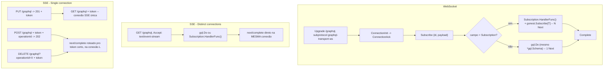

# GraphQL Realtime Protocols Specification

## Problem Statement

O gonest expõe GraphQL Subscriptions via dois transportes ad-hoc próprios (Milestone 17/T9-T10):
`GET /graphql/stream/:name` (SSE) e `GET /graphql/ws/:name` (WebSocket), nenhum seguindo protocolo
padrão nenhum -- formatos que NENHUMA IDE/cliente GraphQL real conhece. Confirmado no mundo real: uma
IDE testando o gonest tentou WebSocket direto em `/graphql` (a mesma URL de `POST /graphql`,
esperando o protocolo `graphql-transport-ws`) e falhou com `{"errors":[{"message":"Unknown GraphQL
error"}]}` (ver `context.md`).

Esta feature substitui os dois transportes ad-hoc pelos protocolos REAIS e amplamente adotados pela
comunidade GraphQL, ambos conectados no MESMO `/graphql` que `POST /graphql` já serve:

1. **`graphql-transport-ws`** (github.com/enisdenjo/graphql-ws) -- WebSocket
2. **`graphql-sse`** (github.com/enisdenjo/graphql-sse) -- Server-Sent Events, nos DOIS modos que o
   protocolo define (Distinct connections e Single connection)

## Goals

### WebSocket (`graphql-transport-ws`)

- [ ] `/graphql` aceita upgrade WebSocket com o subprotocolo `graphql-transport-ws`, além do `POST`
      JSON já existente -- mesma URL, dois transportes
- [ ] Mensagens do protocolo real: `ConnectionInit`/`ConnectionAck`, `Ping`/`Pong`,
      `Subscribe`/`Next`/`Error`/`Complete`
- [ ] Uma `Subscribe` cujo campo bate com uma `Subscription` registrada vira um stream real (N
      mensagens `Next`, reaproveitando `Subscription.HandlerFunc()`/`gonest.Subscribe[T]`)
- [ ] Uma `Subscribe` cujo campo bate com `Query`/`Mutation` vira "single-result operation"
      (exatamente 1 `Next` + `Complete`, reaproveitando o MESMO `*gql.Schema`/`gql.Do` de
      `POST /graphql`)
- [ ] Multiplexação: N operações concorrentes na mesma conexão, isoladas por `id`
- [ ] Fechamentos corretos: `4408` (timeout `ConnectionInit`), `4429` (`ConnectionInit` duplicado),
      `4409` (`id` de `Subscribe` já ativo), `4401` (operação antes do `ConnectionAck`), `4400`
      (mensagem inválida)

### Server-Sent Events (`graphql-sse`) -- Distinct connections mode

- [ ] `GET /graphql` com `Accept: text/event-stream` (GraphQL over HTTP via query string) abre UMA
      conexão SSE para UMA operação, eventos `next`/`complete` (sem `id` -- 1 operação por conexão)
- [ ] Erros de validação (antes da execução) também chegam como evento `next` com o erro no `data`,
      nunca como um `400` HTTP puro (spec exige isso -- `EventSource` nativo não expõe corpo de erro)

### Server-Sent Events (`graphql-sse`) -- Single connection mode

- [ ] `PUT /graphql` cria uma reserva, responde `201` com um token
- [ ] `GET /graphql` (com o token, header `X-GraphQL-Event-Stream-Token` ou query `token`) abre A
      conexão SSE única que vai carregar TODAS as operações dali em diante
- [ ] `POST /graphql` (com o token + `extensions.operationId` no corpo) executa uma operação,
      responde `202`, resultado real chega pela conexão SSE já aberta como `next`/`complete` (`data`
      carrega `{id, payload}`)
- [ ] `DELETE /graphql?operationId=<id>` (+ token) encerra uma Subscription ativa antes dela terminar
      sozinha

## Out of Scope

| Feature | Reason |
| ------- | ------ |
| Subprotocolo legado `graphql-ws` (apollographql/subscriptions-transport-ws) | Descontinuado pelo autor original -- só o moderno `graphql-transport-ws` |
| `Ping` periódico não solicitado, iniciado pelo servidor (WS) | Protocolo permite mas não exige -- v1 só responde `Pong` a um `Ping` recebido |
| Autenticação via `ConnectionInit`'s `payload` (WS) ou reserva (SSE) | v1 aceita sem validar -- nenhum built-in de auth pra WS/SSE existe ainda |
| `@stream`/`@defer` directives | Fora de escopo -- só Subscription usa o conceito de streaming aqui |

## Design Decisions (tomadas durante o brainstorming)

| # | Decisão |
| - | ------- |
| D1 | `GET /graphql/ws/:name` e `GET /graphql/stream/:name` (ad-hoc, Milestone 17) REMOVIDOS por inteiro -- substituídos pelos protocolos reais, nenhum teve consumidor real |
| D2 | Só `graphql-transport-ws` moderno para WS -- sem suporte ao legado `graphql-ws` |
| D3 | Multiplexação suportada desde a v1 (WS) -- N operações concorrentes por conexão, isoladas por `id` |
| D4 | Uma `Subscribe` (WS) pode resolver pra Query/Mutation OU Subscription -- decidido em runtime pelo NOME do campo requisitado |
| D5 | Query/Mutation via WS reaproveitam o MESMO `*gql.Schema`/`gql.Do` de `POST /graphql` -- só o transporte/formatação muda |
| D6 | `graphql-sse`: cobertura COMPLETA -- os dois modos (Distinct connections e Single connection), não só o mais simples |
| D7 | Single connection mode precisa de um registro de reservas ativas (token → conexão SSE) para rotear `POST`/`DELETE` de operação pro `next`/`complete` da conexão certa -- mecanismo novo (context.md) |

## Architecture Note

Reaproveitamento total nos 3: `graphql.Build`'s `*gql.Schema` (já existe), `gql.Do` (já usado por
`POST /graphql`), `Subscription.HandlerFunc()`/`gonest.Subscribe[T]` (Milestone 17). O código
genuinamente novo é a máquina de estado de cada protocolo (parsing de mensagens/eventos, handshake,
dedup de `id`/`operationId`, o registro de reservas do Single connection mode, fechamentos com os
códigos corretos).

## User Stories

### P1: WS -- Handshake + Query/Mutation (single-result operation) ⭐ MVP

**Acceptance Criteria**:

1. WHEN um client faz upgrade WS em `/graphql` com subprotocolo `graphql-transport-ws` THEN o servidor SHALL aceitar
2. WHEN o client manda `ConnectionInit` dentro do timeout THEN o servidor SHALL responder `ConnectionAck`
3. WHEN o client NÃO manda `ConnectionInit` dentro do timeout THEN o servidor SHALL fechar com `4408`
4. WHEN o client manda `Subscribe` com query/mutation THEN o servidor SHALL responder exatamente 1 `Next` + `Complete`

**Independent Test**: uma IDE real conecta via WS, completa handshake, executa uma Query, recebe o resultado -- sem configurar URL alternativa.

---

### P1: WS -- Subscription (streaming operation) ⭐ MVP

**Acceptance Criteria**:

1. WHEN o client manda `Subscribe` com uma Subscription registrada THEN o servidor SHALL mandar um `Next` por `emit(value)`
2. WHEN o client manda `Complete` para um `id` ativo THEN o servidor SHALL parar de emitir pra aquele `id`
3. WHEN a conexão cai THEN toda Subscription ativa naquela conexão SHALL parar

**Independent Test**: Subscription via WS recebe evento de `Emitter.Emit` em tempo real; `Complete` de um `id` não afeta outros `id`s ativos.

---

### P2: WS -- Multiplexação

**Acceptance Criteria**:

1. WHEN dois `Subscribe` com `id`s diferentes chegam na mesma conexão THEN ambos SHALL rodar concorrentemente
2. WHEN um `Subscribe` chega com `id` já em uso THEN o servidor SHALL fechar com `4409`

---

### P1: SSE Distinct connections -- Query/Mutation/Subscription ⭐ MVP

**Acceptance Criteria**:

1. WHEN um client faz `GET /graphql` com `Accept: text/event-stream` e uma query/mutation THEN o servidor SHALL responder 1 evento `next` + `complete`
2. WHEN a operação é uma Subscription THEN o servidor SHALL manter a conexão aberta, um evento `next` por `emit(value)`
3. WHEN a validação falha ANTES da execução THEN o erro SHALL chegar como evento `next` (nunca um `400` HTTP puro)

---

### P2: SSE Single connection -- reserva + multiplexação por `operationId`

**Acceptance Criteria**:

1. WHEN um client faz `PUT /graphql` THEN o servidor SHALL responder `201` com um token de reserva
2. WHEN um client abre `GET /graphql` com o token THEN o servidor SHALL manter essa ÚNICA conexão SSE associada ao token
3. WHEN um client faz `POST /graphql` com o token + `operationId` THEN o servidor SHALL responder `202` e rotear o resultado (`next`/`complete`, carregando `{id, payload}`) pela conexão SSE já aberta daquele token
4. WHEN um client faz `DELETE /graphql?operationId=X` com o token THEN o servidor SHALL encerrar aquela Subscription especificamente, sem afetar outras no mesmo token

## Edge Cases

- WHEN o client WS manda mensagem com `type` desconhecido/inválido THEN o servidor SHALL fechar com `4400`
- WHEN o client WS manda mais de um `ConnectionInit` THEN o servidor SHALL fechar com `4429`
- WHEN o client WS manda qualquer operação ANTES do `ConnectionAck` THEN o servidor SHALL fechar com `4401`
- WHEN `POST`/`PUT`/`GET`/`DELETE` `/graphql` (todos os métodos usados pelos 3 protocolos + o `POST` JSON simples original) convivem no MESMO path THEN o roteamento do adapter Fiber SHALL despachar cada um corretamente por MÉTODO HTTP (a verificar em Design -- `RegisterWebSocket`'s implementação atual usa `app.Use(path, ...)`, que intercepta TODO método no mesmo path; risco real de colisão, não resolvido aqui)
- WHEN um panic acontece dentro de um Handler rodando via qualquer um dos 3 transportes THEN o servidor SHALL responder com uma mensagem/evento de erro isolado àquela operação específica, sem derrubar a conexão inteira
- WHEN uma reserva SSE (Single connection mode) nunca é usada (client faz `PUT` mas nunca conecta o `GET` correspondente) THEN o comportamento de expiração/limpeza da reserva fica em aberto para Design

## Requirement Traceability

| Requirement ID | Story | Phase | Status |
| --------------- | -------------------------------------------------------- | ------- | -------- |
| GQLRT-01 | P1: WS handshake (ConnectionInit/Ack, timeouts) | Execute | Verified |
| GQLRT-02 | P1: WS single-result operation (Query/Mutation) | Execute | Verified |
| GQLRT-03 | P1: WS streaming operation (Subscription) | Execute | Verified |
| GQLRT-04 | P2: WS multiplexação | Execute | Verified |
| GQLRT-05 | P1: SSE Distinct connections mode | Execute | Verified |
| GQLRT-06 | P2: SSE Single connection mode (reserva + multiplexação) | Execute | Verified |
| GQLRT-07 | Remoção dos 2 endpoints ad-hoc (Milestone 17/T9-T10) | Execute | Verified |

## Success Criteria

- [ ] `go test ./... -race` passa após a implementação completa
- [ ] Uma IDE GraphQL real completa handshake + Query + Subscription via WS em `/graphql`
- [ ] SSE Distinct connections funciona via `curl -N` com `Accept: text/event-stream`
- [ ] SSE Single connection funciona via um client de teste que implementa reserva+token+multiplexação
- [ ] `.examples/blog-graphql` atualizado pra demonstrar os 3 transportes reais, substituindo os ad-hoc
