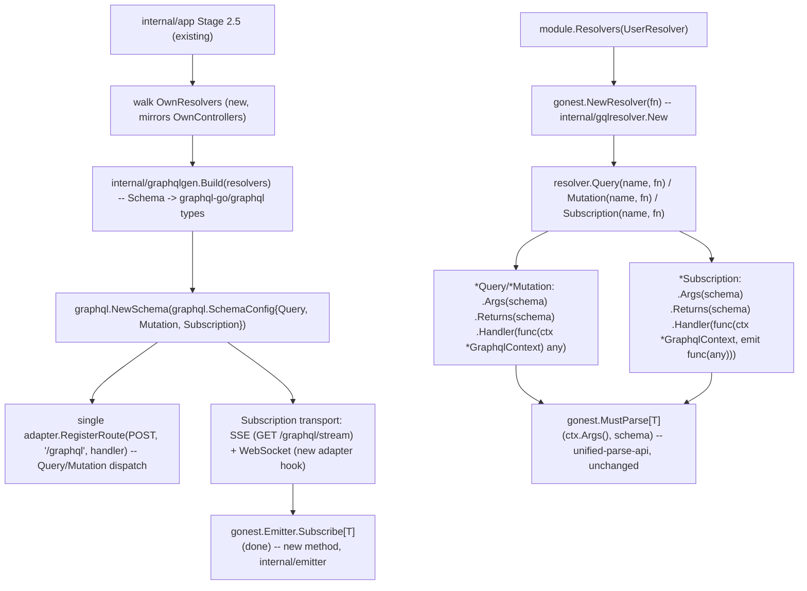

# GraphQL Support Design

**Spec**: `.specs/features/graphql-support/spec.md`
**Context**: `.specs/features/graphql-support/context.md`
**Status**: Draft

---

## Architecture Overview

Every arrow into an existing box (`Schema`/`PropertyBuilder`, `Parse[T]`/
`MustParse[T]`, `Module`/`MustInject`, `Emitter`) is reuse with **zero**
changes to that box's own logic, mirroring how `schema-value-support`
reuses `PropertyBuilder` untouched. The genuinely new surface is small:
one builder package (`internal/gqlresolver`), one generator package
(`internal/graphqlgen`), one new `Emitter` method (`Subscribe[T]`), and
the Subscription transport.

---

## Naming Collision Note

`internal/resolver` **already exists** (DI search helpers,
`FindDirect`/`FindDirectAll`, consumed by `Controller.ResolveDirect` --
see `internal/controller/controller.go:98`). The new GraphQL `Resolver`
builder is an unrelated concept (a `Controller`-analogous declarative
unit) and **must not** live in that package or be named `Resolver` at
the package level. This design uses `internal/gqlresolver` for the
builder types (`Resolver`/`Query`/`Mutation`/`Subscription`) and
`internal/graphqlgen` for the Schema→SDL/graphql-go-type generator (name
already used by spec.md's own Architecture Note). Both new, both
leaf packages (only depend on `internal/schema`, `internal/module`,
`internal/execution`, `internal/emitter` -- never on `internal/resolver`
itself).

---

## Code Reuse Analysis

### Existing Components to Leverage

| Component | Location | How to Use |
| --------- | -------- | ---------- |
| `Controller`/`ControllerRef`/`Module.Controllers` pattern | `internal/controller/controller.go`, `internal/module/module.go:39,145` | `Resolver`/`ResolverRef`/`Module.Resolvers` mirror this shape exactly: deferred `fn`, `Declare()` once, `IsResolver()` marker method, `SetOwnerModule`/`OwnerModule`, `ResolveDirect`/`ResolveDirectAll` delegating to `internal/resolver.FindDirect`/`FindDirectAll` (that package IS reused here, just not as the new package's name -- see Naming Collision Note) |
| `route.New(method, path, fn)` deferred-declare pattern | `internal/route/route.go:74-84` | `Query`/`Mutation`/`Subscription` follow the identical shape: a `New(name, fn)` that runs `fn` immediately (same reasoning as `route.New`'s own doc comment -- by the time `Resolver.Query(...)` runs, we're already inside the Resolver's own deferred `fn`) |
| `schema.Schema`/`PropertyBuilder` (all branches) | `internal/schema/schema.go` | Reused with **zero** changes for `.Args(schema)`/`.Returns(schema)` -- exactly the same `*Schema` REST already uses for `Route.RequestBody`/`RouteResponse.Schema` |
| `Parseable`/`gonest.Parse[T]`/`MustParse[T]` | `internal/execution`, `gonest.go` | `ctx.Args()` returns a `Parseable` (same interface `execution.Request` implements for REST body/query/params) built from the GraphQL request's `Args` map (from graphql-go's own `ResolveParams.Args`); `gonest.MustParse[T](ctx.Args(), schema)` validates identically to REST |
| `MustInject` | `internal/inject`, `gonest.go` | `Resolver.fn`'s closure calls `MustInject[T](resolver, ...)` exactly like `Controller.fn`'s closure does today -- `Resolver` satisfies the same `module.Owner`-shaped contract `Controller` does |
| `Emitter`/`MustOn`/`Emit` | `internal/emitter/emitter.go` | `Subscribe[T]` is a new method added to the SAME `*Emitter` struct (not a new type) -- reuses `e.listeners map[reflect.Type][]reflect.Value`/`e.mu` internally, or a parallel `subscribers` map (see Tech Decisions) |
| `internal/openapi/generate.go`'s dedup-by-pointer pattern (`doc.schemaNames`, `registerSchema`, line ~550-602) | `internal/openapi/generate.go` | `internal/graphqlgen`'s Custom Scalar dedup (spec.md AC: "scalar Email declared once") mirrors this exactly -- a `map[string]bool` (dedup by scalar NAME, not pointer, since multiple *different* `*PropertyBuilder`s can share the same `format`/`GraphqlScalar(name)`) |
| `adapter.RegisterRoute` (Stage 2.5) | `internal/app/app.go:227,560` | Query/Mutation dispatch is registered as ONE ordinary `POST /graphql` route via the EXISTING `RegisterRoute` -- no adapter change needed for P1 |

### Integration Points

| System | Integration Method |
| ------ | ------------------- |
| `internal/module` | Gains `ResolverRef` interface (mirrors `ControllerRef`, `internal/module/module.go:39`), `Resolvers(rs ...ResolverRef)` method, `OwnResolvers()` getter -- same shape as `Controllers`/`OwnControllers` |
| `internal/app` (Stage 2.5) | Gains a resolver-walk step alongside `registerRoutes`: collect every module's `OwnResolvers`, run `Declare()` on each, feed the collected `Query`/`Mutation`/`Subscription` definitions into `internal/graphqlgen.Build(...)`, then register the resulting single `graphql.Schema` via ONE `adapter.RegisterRoute(HttpPost, "/graphql", handler)` (path configurable -- see Tech Decisions) |
| `internal/emitter` | `Subscribe[T any](done <-chan struct{}) <-chan T` new method on `*Emitter` -- internally starts a goroutine that appends a channel to a per-type subscriber list, forwards every `Emit(T{...})` to it, and closes+removes it when `done` fires (context.md's confirmed mechanic: closing is `Subscribe`'s own responsibility, not automatic) |
| `internal/schema` (`PropertyBuilder`) | Gains `GraphqlScalar(name string) *PropertyBuilder` modifier, stored as a new unexported field (`graphqlScalar string`), read back by `internal/graphqlgen` only -- REST/OpenAPI generator ignores it entirely (D5) |
| `gonest.go` | `type Resolver = gqlresolver.Resolver`, `NewResolver = gqlresolver.New`, `type Query = gqlresolver.Query`, `type Mutation = gqlresolver.Mutation`, `type Subscription = gqlresolver.Subscription`, `type GraphqlContext = gqlresolver.GraphqlContext` -- same alias-plus-`var`-wrapper pattern as every other builder (`Controller`/`NewController`) |
| `go.mod` | New direct dependency `github.com/graphql-go/graphql` (D6) |

---

## Components

### `Resolver` (new type -- `internal/gqlresolver`)

- **Purpose**: Declarative unit analogous to `Controller`, registered via `Module.Resolvers`, consuming `MustInject` inside its deferred `fn`.
- **Location**: `internal/gqlresolver/resolver.go`
- **Interfaces**: `New(fn func(*Resolver)) *Resolver`, `(*Resolver) Declare()`, `(*Resolver) IsResolver()`, `(*Resolver) SetOwnerModule(*module.Module)`/`OwnerModule()`, `(*Resolver) ResolveDirect(reflect.Type) (reflect.Value, bool)`/`ResolveDirectAll(...)`, `(*Resolver) Query(name string, fn func(*Query))`, `(*Resolver) Mutation(name string, fn func(*Mutation))`, `(*Resolver) Subscription(name string, fn func(*Subscription))`, `(*Resolver) OwnQueries()`/`OwnMutations()`/`OwnSubscriptions()` (read-only copies, same pattern as `OwnRoutes`)
- **Dependencies**: `internal/module` (for `module.Owner`), `internal/resolver` (for `FindDirect`/`FindDirectAll`, reused as-is)
- **Reuses**: 100% of `Controller`'s deferred-fn/Declare-once/marker-method shape

### `Query` / `Mutation` (new types -- `internal/gqlresolver`)

- **Purpose**: One declared GraphQL query or mutation field -- name, args schema, return schema, handler.
- **Location**: `internal/gqlresolver/query.go`, `internal/gqlresolver/mutation.go` (two thin files; both are IDENTICAL in shape today -- see Tech Decisions on whether to actually share one struct)
- **Interfaces**: `New(name string, fn func(*Query)) *Query`, `(*Query) Args(s *schema.Schema) *Query`, `(*Query) Returns(s *schema.Schema) *Query`, `(*Query) Handler(fn func(ctx *GraphqlContext) any) *Query`, plus getters (`Name()`, `ArgsSchema()`, `ReturnsSchema()`, `HandlerFunc()`)
- **Dependencies**: `internal/schema`
- **Reuses**: Same New(fn-runs-immediately) shape as `route.New`

### `Subscription` (new type -- `internal/gqlresolver`)

- **Purpose**: One declared GraphQL subscription field -- name, args schema, return schema, streaming handler.
- **Location**: `internal/gqlresolver/subscription.go`
- **Interfaces**: `New(name string, fn func(*Subscription)) *Subscription`, `(*Subscription) Args(s *schema.Schema) *Subscription`, `(*Subscription) Returns(s *schema.Schema) *Subscription`, `(*Subscription) Handler(fn func(ctx *GraphqlContext, emit func(any))) *Subscription`
- **Dependencies**: `internal/schema`
- **Reuses**: Same declarative shape as `Query`/`Mutation`, distinct `Handler` signature per D3

### `GraphqlContext` (new type -- `internal/gqlresolver`)

- **Purpose**: The single parameter passed to every Handler -- wraps graphql-go's `graphql.ResolveParams` behind gonest's own vocabulary (`ctx.Args()` returns a `Parseable`, `ctx.Done()` returns `<-chan struct{}` for Subscription cancellation, mirroring `context.Context`'s own `Done()` idiom per context.md).
- **Location**: `internal/gqlresolver/context.go`
- **Interfaces**: `(*GraphqlContext) Args() execution.Parseable`, `(*GraphqlContext) Done() <-chan struct{}`
- **Dependencies**: `internal/execution` (`Parseable` interface, reused unchanged)
- **Reuses**: `execution.Parseable`, exactly as `execution.Request` already implements it for REST

### `internal/graphqlgen` (new package)

- **Purpose**: Given the full set of registered `Query`/`Mutation`/`Subscription` (each carrying `*schema.Schema` for Args/Returns), build a `*graphql.Schema` (graphql-go/graphql). Mirrors `internal/openapi`'s existing role for REST -- a pure generator, no request-time logic.
- **Location**: `internal/graphqlgen/generate.go` (+ `scalar.go` for Custom Scalar dedup)
- **Interfaces**: `Build(queries []*gqlresolver.Query, mutations []*gqlresolver.Mutation, subscriptions []*gqlresolver.Subscription) (*graphql.Schema, error)`
- **Dependencies**: `github.com/graphql-go/graphql`, `internal/schema`, `internal/gqlresolver`
- **Reuses**: `PropertyBuilder.KindValue()`/`FormatValue()`/`MinValue()`/`MaxValue()`/`PatternValue()`/`ItemBuilder()`/`ItemRef()`/`SchemaRef()`/`CustomFunc()` -- the exact same accessor surface `internal/openapi/generate.go` already reads to build OpenAPI schemas, now read to build `graphql.Fields`/`graphql.InputObjectFieldConfig` instead. Dedup-by-name pattern mirrors `registerSchema`'s dedup-by-pointer (`internal/openapi/generate.go:550-602`).

### `Emitter.Subscribe[T]` (new method -- `internal/emitter`)

- **Purpose**: Dynamic, per-connection channel that receives every future `Emit(T{...})` until `done` closes.
- **Location**: `internal/emitter/subscribe.go` (new file, alongside existing `emitter.go`/`listener.go`)
- **Interfaces**: `func Subscribe[T any](e *Emitter, done <-chan struct{}) <-chan T` (free function, same reason `MustOn[EventType]` is a free function today -- Go methods can't take their own type parameters)
- **Dependencies**: none beyond `*Emitter`'s existing internals
- **Reuses**: `Emitter`'s existing `reflect.Type`-keyed registration model, extended with a second registry (`subscribers map[reflect.Type][]reflect.Value` of channels, separate from `listeners`) since a Subscribe channel is fundamentally different lifecycle (dynamic, cancelable) from a `MustOn` handler (static, app-lifetime)

### Subscription Transport (new -- SSE + WebSocket)

- **Purpose**: Deliver Subscription events to connected clients over two protocols, per D7/context.md's explicit "gonest builds this itself" decision.
- **Location**: `internal/gqltransport/sse.go`, `internal/gqltransport/ws.go` (new leaf package; kept OUT of `internal/gqlresolver`/`internal/graphqlgen` since it is pure I/O plumbing, not schema/builder logic)
- **Interfaces**: TBD in Tasks -- SSE reuses the EXISTING `adapter.RegisterRoute` (an SSE response is just a long-lived HTTP response with `Content-Type: text/event-stream`, no adapter change needed); WebSocket needs a NEW `HttpAdapter` method (Fiber v3 has native WebSocket upgrade support -- see Tech Decisions) since `RegisterRoute`'s handler signature (`func(req, res)`) has no upgrade hook today
- **Dependencies**: `internal/adapter/fiber` (WS upgrade), `internal/gqlresolver` (Subscription definitions), `internal/emitter` (`Subscribe[T]`)
- **Reuses**: Reference wire-compatibility with `graphql-ws`/`graphql-transport-ws` (WS) and `graphql-sse` (SSE) specs for client interop (Apollo Client, urql) -- implemented independently, not vendored (context.md)

---

## Tech Decisions

| Decision | Choice | Rationale |
| -------- | ------ | --------- |
| `Query`/`Mutation` share one underlying struct or stay fully separate types? | A decidir em Tasks -- ambas têm exatamente os mesmos campos (`name`, `args *schema.Schema`, `returns *schema.Schema`, `handler func(*GraphqlContext) any`) hoje; um alias (`type Mutation = Query`) evitaria duplicar 100% do código, mas a decisão espelha o mesmo debate deixado em aberto para `Value`/`PropertyBuilder` em `schema-value-support` -- só vale um tipo novo se algo genuinamente DIFERENTE aparecer (ex: Mutation ganhar side-effect tracking futuro) | Minimiza código novo até haver motivo real de divergência |
| Endpoint HTTP fixo (`/graphql`) ou configurável? | A decidir em Tasks -- provável `gonest.NewApp`/`Options` ganha um campo opcional (default `/graphql`, mesmo padrão de outros defaults do framework, ex: `defaultHttpCode` em `route.go`) | Não bloqueia P1; um default fixo já cobre o MVP, configurabilidade é aditiva depois |
| WebSocket: nova capability na interface `HttpAdapter`, ou acesso direto ao `*fiber.App` só para este caso? | A decidir em Tasks -- `internal/adapter/fiber/fiber.go`'s `HttpAdapter` interface (`internal/app/app.go:224-227`) precisa ser lido por inteiro antes de decidir a assinatura exata do novo método (`RegisterWebSocket(path string, h func(...)) error`, forma exata TBD); acoplar demais a `*fiber.App` quebraria a abstração de adapter que o resto do framework mantém | Preserva a promessa de múltiplos adapters (mesmo que hoje só Fiber exista) sem travar em Design uma API que Tasks ainda vai precisar confirmar contra o código real |
| `Subscribe[T]`'s internal registry: reusar `Emitter.listeners` (adicionando um "is this a channel-forwarder" wrapper) ou campo `subscribers` separado? | Campo `subscribers` separado (ver Component acima) | `listeners` guarda `func(ctx, event)` handlers estáticos (`MustOn`), registrados uma vez, vivos pra sempre; um subscriber dinâmico tem lifecycle fundamentalmente diferente (cancelável via `done`) -- misturar os dois no mesmo mapa exigiria distinguir os dois casos em `Emit`'s hot path a cada evento, custo desnecessário quando dois mapas resolvem sem ambiguidade |
| `internal/graphqlgen`'s Custom Scalar dedup key | Nome do scalar (`string`), não ponteiro do `*PropertyBuilder` | Múltiplos `PropertyBuilder`s DIFERENTES compartilham o mesmo `GraphqlScalar(name)`/`format` -- dedup por identidade (como `registerSchema` faz pra `$ref`) dedupliclaria errado aqui; dedup por nome é o que spec.md AC2/AC3 realmente pedem |
| `graphql-go/graphql` entra como dependência direta em `go.mod`, versão pinada em qual tag? | A confirmar em Tasks -- `go get github.com/graphql-go/graphql@latest` no momento da implementação real (não fixar uma versão aqui, especificação não deve fabricar um número de versão que pode já estar desatualizado quando Tasks/Execute rodar) | Knowledge Verification Chain -- não fabricar dado verificável só na hora |

---

## Error Handling Strategy

| Error Scenario | Handling | Caller Sees |
| --------------- | -------- | ----------- |
| `Custom(fn)` usado num campo de um `Schema` referenciado por `.Args`/`.Returns` SEM `.GraphqlScalar(name)` | `internal/graphqlgen.Build` retorna erro (build-time da montagem do `graphql.Schema`, chamado uma vez em Stage 2.5 -- nunca por request) -- mesma categoria de "erro de programador" que `resolveSchema`'s panic hoje (spec.md AC4, D5) | Falha de BOOT do app (mesma severidade que qualquer outro erro de Stage 2.5 hoje), nunca uma falha de request |
| `Args` inválidos num Query/Mutation/Subscription real | `gonest.MustParse[T](ctx.Args(), schema)` propaga o MESMO erro de validação que REST já produz (`BadRequestException`-shaped, unified-parse-api) | Erro GraphQL-shaped (`errors: [...]`) equivalente a uma REST 400 -- tradução exata do formato feita pelo dispatch em `internal/graphqlgen`/handler HTTP, TBD em Tasks |
| Panic dentro do Handler de uma Subscription | Reconhecido como gap NÃO resolvido nesta spec (spec.md Edge Cases, Out of Scope) -- comportamento mínimo aceitável: `recover()` na goroutine daquela conexão específica (mesmo padrão defensivo que `Emitter.Emit` já usa, `internal/emitter/emitter.go:66-73`), sem propagar ao processo, MAS sem fechar graciosamente nem notificar o client com uma mensagem GraphQL-shaped -- ficará documentado como limitação conhecida em Tasks/README, não silenciosamente ignorado | Conexão daquele client especificamente para de receber eventos (sem crash do processo); melhoria (erro GraphQL-shaped no canal) fica como Deferred Idea |
| `done` nunca fecha (client nunca desconecta, ex: bug no transporte) | `Subscribe[T]`'s goroutine interna vaza (mesma classe de risco que qualquer canal Go não fechado) -- Tasks deve cobrir isso com um teste de regressão que força `done` a fechar e confirma via `runtime.NumGoroutine()` (ou padrão equivalente já usado em outros testes de concorrência do repo) que a goroutine realmente encerra | N/A -- bug interno, não erro de API pública |
| Duas Subscriptions com o mesmo `name` registradas no mesmo `Resolver` (ou entre dois Resolvers) | A decidir em Tasks -- provável panic em `internal/graphqlgen.Build` (nome duplicado gera SDL inválido), mesma severidade que `Custom` sem `GraphqlScalar` acima | Falha de boot, não de request |

---

## Traceability to Spec

| Requirement ID | Design Component |
| -------------- | ---------------- |
| GQL-01 | `Resolver`/`Query`/`Mutation` (`internal/gqlresolver`), `Module.Resolvers`/`OwnResolvers` |
| GQL-02 | `internal/graphqlgen.Build` |
| GQL-03 | `internal/graphqlgen`'s format→scalar mapping (native formats) |
| GQL-04 | `PropertyBuilder.GraphqlScalar(name)` + `internal/graphqlgen`'s dedup-by-name |
| GQL-05 | `Subscription` type, `Emitter.Subscribe[T]` |
| GQL-06 | WebSocket transport (`internal/gqltransport/ws.go`, new `HttpAdapter` capability) |
| GQL-07 | SSE transport (`internal/gqltransport/sse.go`, reuses existing `adapter.RegisterRoute`) |
