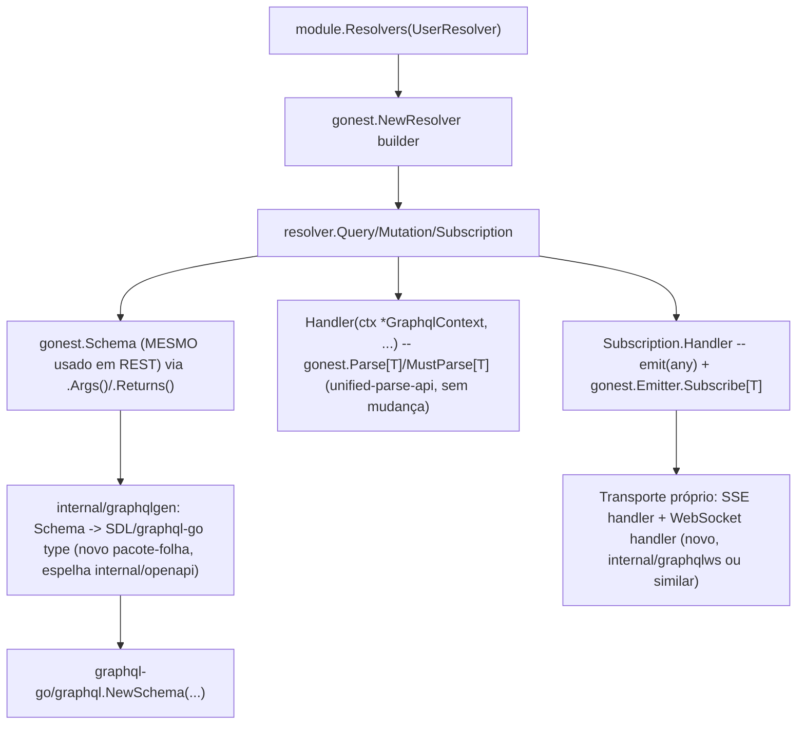

# GraphQL Support Specification

## Problem Statement

O gonest hoje só expõe REST (`Controller`/`Route`). NestJS (a inspiração
direta do framework) resolve GraphQL via `Resolver`/`@Query`/`@Mutation`/
`@Subscription`, reaproveitando o MESMO sistema de DI/validação que já usa
para REST. O gonest tem infraestrutura equivalente já pronta
(`gonest.Schema`/`PropertyBuilder`, `gonest.Parse[T]`/`MustParse[T]`,
`Module`/`MustInject`, `gonest.Emitter`) que criam um caminho natural para
suportar GraphQL sem duplicar validação/DI -- só precisa de uma nova
"ponta de exposição" (Resolver), análoga a como `Controller` já expõe
REST.

## Goals

- [ ] `gonest.NewResolver(func(resolver *gonest.Resolver) {...})` --
      builder análogo a `Controller`, registrado via `module.Resolvers(...)`
- [ ] `resolver.Query(name, func(q *gonest.Query) {...})` /
      `resolver.Mutation(name, func(m *gonest.Mutation) {...})` -- ambos
      com `.Args(schema)`, `.Returns(schema)`, `.Handler(func(ctx *gonest.GraphqlContext) any)`
      (retorno direto = data, sem `Response` separado)
- [ ] `resolver.Subscription(name, func(s *gonest.Subscription) {...})` --
      `.Handler(func(ctx *gonest.GraphqlContext, emit func(any)) {...})`,
      reaproveitando `gonest.Emitter` (via um novo `Emitter.Subscribe[T](done <-chan struct{}) <-chan T`)
- [ ] Geração automática de SDL a partir do MESMO `gonest.Schema` já usado
      para REST/OpenAPI -- branches de formato (`Email`/`Uuid`/`DateTime`/
      etc) viram Custom Scalars GraphQL
- [ ] `PropertyBuilder.Custom(fn).GraphqlScalar(name)` -- nomeia o scalar
      GraphQL de um `Custom(fn)` sem equivalente `format` OpenAPI nativo
      (ex: `primitive.ObjectID` do MongoDB)
- [ ] Motor por baixo: `graphql-go/graphql` (code-first, runtime, sem
      `go generate` -- ver Design Decisions)
- [ ] Transporte de Subscription: solução própria cobrindo SSE e
      WebSocket (nenhum dos dois vem pronto de `graphql-go/graphql`)

## Out of Scope

| Feature                                              | Reason                                                                                     |
| ----------------------------------------------------- | -------------------------------------------------------------------------------------------- |
| `Value` cobrindo Array/Object no nível raiz para GraphQL | Depende de `schema-value-support` (Milestone 15) decidir isso primeiro -- fora de escopo aqui |
| Registro de scalar em algo equivalente a `components.schemas` | Não pensado ainda -- se um scalar nomeado precisa de identidade própria reusável |
| Erro dentro de Subscription (canal de erro próprio, ex: `emitError(err)`) | Reconhecido como gap real na reflexão original (`INSIGHT-GRAPHQL.md`), não resolvido nesta especificação -- ver Edge Cases |
| Federation / schema stitching entre múltiplos serviços | Fora de escopo -- v1 de GraphQL é um único schema por app, mesmo padrão do REST atual |
| DataLoader / batching de N+1 | Fora de escopo desta primeira versão -- otimização de performance, não funcionalidade core |

---

## Design Decisions (tomadas durante o brainstorming)

| #   | Decisão                                                                                                                                                                                  |
| --- | ------------------------------------------------------------------------------------------------------------------------------------------------------------------------------------------ |
| D1  | Resolver reaproveita 100% do padrão builder+DI já usado por `Controller` -- `MustInject` funciona idêntico dentro de um `Resolver` |
| D2  | Query/Mutation usam `Handler(func(ctx *GraphqlContext) any)` -- retorno direto vira o data, SEM um `Response`/`.Data()` separado (GraphQL não tem status/headers pra justificar um write-side rico como REST tem) |
| D3  | Subscription usa assinatura DIFERENTE (`func(ctx *GraphqlContext, emit func(any))`) -- é um STREAM, não request-response, não cabe no mesmo `Handler(ctx) any` |
| D4  | Subscription reaproveita `gonest.Emitter` (já existe, Event Emitter feature) via um método NOVO `Emitter.Subscribe[T](done <-chan struct{}) <-chan T` -- canal dinâmico, cancelado quando `done` fecha, complementar ao `MustOn` estático já existente |
| D5  | `Custom(fn)` ganha `.GraphqlScalar(name)` -- só relevante quando o schema é usado por um Resolver, REST/OpenAPI ignoram esse valor. Dois campos com o MESMO nome de scalar geram UMA declaração `scalar X` (dedup por nome, mesmo padrão de `$ref` já usado no gerador OpenAPI) |
| D6  | Motor: `graphql-go/graphql` (code-first) sobre `gqlgen` (schema-first, exige `.graphql` manual + `go generate`) -- ver pesquisa registrada em `INSIGHT-GRAPHQL.md` |
| D7  | Transporte de Subscription (SSE + WebSocket) é responsabilidade do gonest implementar -- `graphql-go/graphql` só resolve a sintaxe/execução de campo, não trouxe streaming pronto (issue histórica confirmada, graphql-go/graphql#49) |
| D8  | `Property`/`NewSchema[T]` (REST, struct) permanecem INALTERADOS -- Resolver é só mais uma ponta de exposição sobre a MESMA declaração de schema |

---

## Architecture Note

Reaproveitamento total do que já existe: `Schema`/`PropertyBuilder` (branches
de tipo+format), `Parseable`/`Parse[T]`/`MustParse[T]` (unified-parse-api),
`Module`/`MustInject` (DI), `gonest.Emitter` (event bus, ganha só
`Subscribe[T]` novo). O único código genuinamente NOVO é: (1) o builder
`Resolver`/`Query`/`Mutation`/`Subscription`, (2) o gerador Schema→SDL/
graphql-go-type (`internal/graphqlgen`, nome a definir em Design), (3) o
transporte SSE+WS.

---

## API Sketch

Ver `INSIGHT-GRAPHQL.md` (repo root) -- contém o sketch completo (Query,
Mutation, Subscription com `Emitter.Subscribe`, Custom Scalars pra
Email/Uuid/DateTime, `GraphqlScalar(name)` pra tipos verdadeiramente
customizados como `primitive.ObjectID`). Não duplicado aqui para evitar
duas fontes de verdade divergindo -- este spec.md referencia o INSIGHT
como o sketch vivo, atualizado durante o brainstorming.

---

## User Stories

### P1: `Resolver`/`Query`/`Mutation` básicos ⭐ MVP

**User Story**: Como desenvolvedor, quero declarar Queries e Mutations
GraphQL reaproveitando o MESMO `gonest.Schema` que já uso pra REST, com
DI idêntica a um Controller.

**Why P1**: Núcleo da feature -- Subscription e geração de SDL dependem
disso existir primeiro.

**Acceptance Criteria**:

1. WHEN `gonest.NewResolver(fn)` é registrado via `module.Resolvers(...)` THEN `MustInject` dentro do builder SHALL funcionar idêntico a `Controller`
2. WHEN `resolver.Query(name, func(q *Query) {...})` declara `.Args(schema)`/`.Returns(schema)`/`.Handler(func(ctx) any)` THEN uma query GraphQL real com esse nome SHALL invocar o Handler, validando args via `gonest.MustParse[T](ctx.Args(), schema)`
3. WHEN o Handler retorna um valor THEN esse valor SHALL virar o `data` da resposta GraphQL, sem chamada explícita adicional
4. WHEN `resolver.Mutation` é usado THEN SHALL ter o comportamento idêntico ao Query (mesma assinatura de Handler), só a semântica GraphQL (side-effect esperado) muda

**Independent Test**: uma query GraphQL real (via dispatch HTTP, mesmo padrão de `app.Test`) retorna o dado esperado; um Args inválido produz erro de validação equivalente ao REST (`BadRequestException`-shaped).

---

### P1: Geração automática de SDL a partir do `Schema` ⭐ MVP

**User Story**: Como desenvolvedor, quero que o SDL do meu schema GraphQL
seja gerado automaticamente a partir da MESMA declaração `gonest.Schema`
que já uso pra REST/OpenAPI, sem duplicar a definição de tipos.

**Why P1**: Sem isso, cada `Query`/`Mutation`/`Subscription` precisaria de
uma declaração de tipo GraphQL manual -- perde a promessa central da
reflexão ("Uma Única Fonte de Verdade").

**Acceptance Criteria**:

1. WHEN um `gonest.Schema` (struct) é usado em `.Returns(schema)` THEN o gerador SHALL produzir um `type X { ... }` GraphQL equivalente
2. WHEN um campo tem um branch de formato (`Email`/`Uuid`/`Uri`/`Hostname`/`Ipv4`/`Ipv6`/`DateTime`/`Date`) THEN SHALL virar um Custom Scalar GraphQL (uma declaração `scalar X` por formato distinto usado no app, não repetida por campo)
3. WHEN um campo usa `Custom(fn).GraphqlScalar(name)` THEN SHALL virar um Custom Scalar nomeado por `name`, deduplicado por nome entre múltiplos campos que usam o mesmo `GraphqlScalar(name)`
4. WHEN um campo usa `Custom(fn)` SEM `.GraphqlScalar(name)` E o schema é usado por um Resolver THEN SHALL falhar em BUILD TIME da geração de SDL (erro de configuração, não falha de request)

**Independent Test**: o SDL gerado para um `UserEntity` com campos `Email`/`DateTime` reproduz exatamente o exemplo de `INSIGHT-GRAPHQL.md`'s seção "Branches de formato viram Custom Scalars".

---

### P2: `Subscription` com transporte SSE + WebSocket

**User Story**: Como desenvolvedor, quero declarar uma Subscription
GraphQL que emite eventos em tempo real para o client, reaproveitando o
`gonest.Emitter` que já uso pra eventos internos do app.

**Why P2**: Depende de P1 (Resolver/geração de SDL) já existir; é o
componente mais arriscado tecnicamente (motor escolhido não traz
streaming pronto -- D7).

**Acceptance Criteria**:

1. WHEN `resolver.Subscription(name, func(s *Subscription) {...})` declara `.Handler(func(ctx, emit) {...})` THEN `emit(value)` SHALL publicar um evento para o client conectado
2. WHEN `gonest.Emitter.Subscribe[T](done <-chan struct{})` é chamado THEN SHALL devolver um `<-chan T` que recebe toda publicação futura de `Emit(T{...})`, e SHALL fechar esse canal quando `done` for fechado (sem vazar goroutine)
3. WHEN um client conecta via WebSocket THEN SHALL conseguir assinar/receber eventos de uma Subscription
4. WHEN um client conecta via SSE (Server-Sent Events) THEN SHALL conseguir assinar/receber eventos da MESMA Subscription (mesmo Handler, transporte diferente)
5. WHEN o client desconecta (WS fecha, ou SSE connection encerra) THEN o `ctx.Done()` passado ao Handler SHALL fechar, permitindo que o Handler libere recursos (`defer unsubscribe()`/equivalente)

**Independent Test**: um evento publicado via `Emitter.Emit(SomeEvent{...})` chega a um client de teste conectado via WebSocket E a outro conectado via SSE, ambos assinando a mesma Subscription; desconectar um client não afeta o outro.

---

## Edge Cases

- WHEN um panic acontece DENTRO do Handler de uma Subscription THEN o comportamento NÃO está definido nesta spec (D7/Out of Scope reconhece isso como gap) -- na ausência de solução, um panic HOJE derrubaria a goroutine daquela conexão especificamente sem crashar o processo (comportamento mínimo aceitável a confirmar em Design), mas não fecha graciosamente nem notifica o client com uma mensagem de erro GraphQL-shaped
- WHEN o mesmo formato (ex: `email`) é usado por múltiplos campos em múltiplos schemas diferentes THEN a declaração `scalar Email` SHALL aparecer só UMA vez no SDL final
- WHEN um schema construído via `NewSchema[T]` (struct) é usado tanto em REST (`Route.RequestBody`) quanto em GraphQL (`Query.Returns`) THEN a MESMA declaração SHALL servir aos dois sem exigir duplicação

---

## Requirement Traceability

| Requirement ID | Story                                          | Phase   | Status  |
| -------------- | ------------------------------------------------- | ------- | ------- |
| GQL-01         | P1: Resolver/Query/Mutation básicos                | Execute | Verified |
| GQL-02         | P1: Geração de SDL a partir do Schema              | Execute | Verified |
| GQL-03         | P1: Custom Scalars (formato nativo)                | Execute | Verified |
| GQL-04         | P1: GraphqlScalar(name) para Custom(fn)            | Execute | Verified |
| GQL-05         | P2: Subscription + Emitter.Subscribe               | Execute | Verified |
| GQL-06         | P2: Transporte WebSocket                           | Execute | Verified |
| GQL-07         | P2: Transporte SSE                                 | Execute | Verified |

---

## Success Criteria

- [ ] `go test ./... -race` passa após a implementação completa
- [ ] Uma Query/Mutation real reproduz o sketch de `INSIGHT-GRAPHQL.md` via dispatch HTTP real
- [ ] SDL gerado bate exatamente com os exemplos documentados (Custom Scalars incluídos)
- [ ] Uma Subscription real entrega eventos por WebSocket E por SSE simultaneamente a clients diferentes
