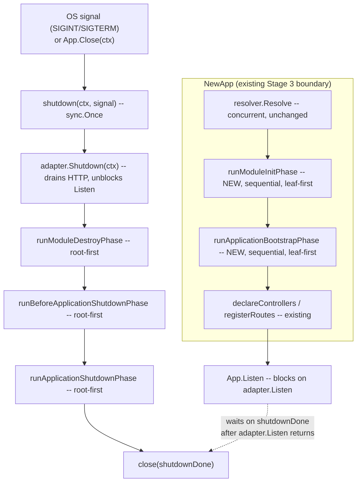

# Lifecycle Hooks Design

**Spec**: `.specs/features/lifecycle-hooks/spec.md`
**Context**: `.specs/features/lifecycle-hooks/context.md`
**Status**: Approved

---

## Architecture Overview

Two independent additions bolt onto the existing 3-stage bootstrap (`internal/app.NewApp`) without
changing Stage 3's own concurrency:

1. **Bootstrap-time hooks** (`OnModuleInit`/`OnApplicationBootstrap`) run as 2 new SEQUENTIAL passes
   inserted between Stage 3 (`resolver.Resolve`, already concurrent) and Stage 2 (`declareControllers`).
   They read each Provider's already-resolved value (`ResolvedValue()`, existing) — no new resolution
   logic, purely a "notify me once you're ready" callback.
2. **Shutdown hooks** (`OnModuleDestroy`/`BeforeApplicationShutdown`/`OnApplicationShutdown`) are
   opt-in via a new `App.EnableShutdownHooks()`, wired to both OS signals and a new manual
   `App.Close(ctx)`. Both paths converge on one internal `shutdown(ctx, signal)` guarded by
   `sync.Once`, itself sequenced into 3 passes matching Nest's documented order.



---

## Code Reuse Analysis

### Existing Components to Leverage

| Component | Location | How to Use |
| --- | --- | --- |
| `Provider.Constructor`'s 4-signature validation (`isValidConstructorSignature`) | `internal/provider/provider.go` | Mirror the exact pattern (reflect-based shape check) for the 2 hook signature families (with/without `signal string`) |
| `callConstructor`'s panic-recovery + optional-`context.Context`-arg + optional-`error`-return call convention | `internal/resolver/stage3.go:351` | Mirror in a new `internal/provider/lifecycle.go` helper — same mechanics, invoked against an ALREADY-resolved value instead of building one |
| `Provider.ResolvedValue()` (existing, exported) | `internal/provider/provider.go` | Read-only source of the instance to pass as the hook's first argument — zero new storage needed |
| `Module.OwnProviders()` + `root.Assemble()`'s BFS-ordered `[]*Module` (root-first) | `internal/module/module.go`, `internal/module/assemble.go` | Reused AS-IS for phase ordering: reverse copy = leaf-first (Init/Bootstrap), as-is = root-first (Destroy phases) — no new traversal |
| `declareProviders`/`declareControllers`-style "walk modules, type-assert, call" loop | `internal/app/app.go:749-818` | Same shape for the 5 new phase-runner functions |
| `AppOptions`-style opt-in boolean (`EnableFormStreaming`, `DisableBanner`) | `internal/app/options.go` | Precedent for `EnableShutdownHooks` being an explicit call, not a default-on `Options` field (matches Nest's own opt-in framing, decided in context.md) |

### Integration Points

| System | Integration Method |
| --- | --- |
| `internal/adapter/fiber.FiberApp` | Gains `Shutdown(ctx context.Context) error`, calling Fiber v3's real `app.ShutdownWithContext(ctx)` (confirmed via Context7 against `/gofiber/docs`) |
| `internal/app.HttpAdapter` interface | Gains `Shutdown(ctx context.Context) error` — breaking change to an `internal/`-only interface, same category as AD-022's `Init(opts)` addition; test fakes (`recordingFakeAdapter`, `listenSpyAdapter` in `internal/app/*_test.go`) need the method added, mechanical |

---

## Components

### `internal/provider/lifecycle.go` (new file)

- **Purpose**: registration + invocation of the 5 lifecycle hooks on `*Provider`
- **Location**: `internal/provider/lifecycle.go`
- **Interfaces**:
  - `OnModuleInit(fn any)` / `OnApplicationBootstrap(fn any)` / `OnModuleDestroy(fn any)` — accept
    `func(T)` / `func(T) error` / `func(T, context.Context)` / `func(T, context.Context) error`;
    panics `"gonest: invalid OnModuleInit signature"` (etc.) on any other shape, mirroring
    `Constructor`'s exact panic-message convention
  - `BeforeApplicationShutdown(fn any)` / `OnApplicationShutdown(fn any)` — accept the same 4 shapes
    PLUS a trailing `signal string` parameter: `func(T, string)` / `func(T, string) error` /
    `func(T, context.Context, string)` / `func(T, context.Context, string) error`
  - `RunModuleInit(ctx context.Context) error` / `RunApplicationBootstrap(ctx context.Context) error` /
    `RunModuleDestroy(ctx context.Context) error` (exported, called by `internal/app`'s phase runners)
    — no-op (`return nil`) if the corresponding hook was never registered, OR if
    `p.ResolvedScope() != scope.Singleton` (Request/Transient excluded per context.md), OR if
    `ResolvedValue()` reports not-yet-set (defensive; should not happen given call-site ordering)
  - `RunBeforeApplicationShutdown(ctx context.Context, signal string) error` /
    `RunApplicationShutdown(ctx context.Context, signal string) error` — same no-op rules
- **Dependencies**: `reflect`, `context`, `internal/scope` (for the Singleton-only guard)
- **Reuses**: `Provider.resolvedValue`/`ResolvedValue()` (existing field/method), the exact
  panic-recovery pattern from `callConstructor`

### `internal/app` phase runners (new file `internal/app/lifecycle.go`)

- **Purpose**: walk the assembled module tree in the right order, invoking each Provider's
  `RunXxx` for one phase; own `App.EnableShutdownHooks()`/`App.Close(ctx)`/the `shutdown` orchestrator
- **Location**: `internal/app/lifecycle.go`
- **Interfaces**:
  - `runModuleInitPhase(ctx context.Context, modules []*module.Module) error` — leaf-first
    (`reverse(modules)`), sequential across modules AND across each module's own providers
    (`OwnProviders()` declaration order); first error returned immediately (fail-fast, stops the
    ENTIRE phase, not just remaining providers in the current module)
  - `runApplicationBootstrapPhase(ctx, modules) error` — same traversal/fail-fast shape, runs only
    after `runModuleInitPhase` returns nil
  - `runModuleDestroyPhase(ctx, modules) error` / `runBeforeApplicationShutdownPhase(ctx, modules) error` /
    `runApplicationShutdownPhase(ctx, modules, signal string) error` — root-first (`modules` as-is,
    no reversal), same fail-fast shape; the 3 run strictly in sequence, and (per Nest's real
    single-sequential-await-chain semantics — see Tech Decisions) an error in ANY of the 3 phases
    aborts the remaining phases too, not just the remaining providers in the current phase
  - `(a *App) EnableShutdownHooks() *App` — sets `a.shutdownHooksEnabled = true`, starts a goroutine
    registering `os.Interrupt` + `syscall.SIGTERM` via `signal.Notify`, calling
    `a.shutdown(context.Background(), signalName)` on receipt. Returns `a` (chainable, matches no
    existing precedent strongly but is a harmless ergonomic addition — see Tech Decisions)
  - `(a *App) Close(ctx context.Context) error` — calls `a.shutdown(ctx, "")` directly (manual trigger,
    empty signal string — see Tech Decisions), returns whatever error the sequence produced
  - `(a *App) shutdown(ctx context.Context, signal string) error` — `sync.Once`-guarded body:
    `a.adapter.Shutdown(ctx)` (always — draining HTTP does not require `EnableShutdownHooks`, mirrors
    Nest's `app.close()` always being callable) → if `a.shutdownHooksEnabled`: run the 3 destroy
    phases in sequence → store result in `a.shutdownErr` → `close(a.shutdownDone)`
- **Dependencies**: `internal/module`, `os/signal`, `syscall`, `sync`
- **Reuses**: `Module.OwnProviders()`, the existing `declarable`-style type-assertion pattern already
  used by `declareProviders`/`declareControllers`

### `internal/app/app.go` changes (existing file)

- `HttpAdapter` interface gains `Shutdown(ctx context.Context) error`
- `App` struct gains: `modules []*module.Module`, `shutdownHooksEnabled bool`, `shutdownOnce sync.Once`,
  `shutdownDone chan struct{}`, `shutdownErr error` (channel initialized in `NewApp`, always — cheap,
  avoids a nil-channel branch)
- `NewApp`: after `resolver.Resolve(ctx, modules)` succeeds and before `declareControllers(modules)`,
  insert:
  ```go
  if err := runModuleInitPhase(ctx, modules); err != nil {
      return nil, err
  }
  if err := runApplicationBootstrapPhase(ctx, modules); err != nil {
      return nil, err
  }
  ```
  (same `ctx` Stage 3 already built with `bootstrapTimeout` — hooks share that budget, no new timeout)
- Returned `*App` literal gains `modules: modules`
- `Listen`: after `a.adapter.Listen(addr, onListenFunc)` returns with a NIL error, if
  `a.shutdownHooksEnabled`, block on `<-a.shutdownDone` before returning, then return `a.shutdownErr`
  instead of `nil` (propagates a shutdown-hook failure through `Listen`'s existing return path, so
  `MustListen` panics on it exactly like any other `Listen` failure — no new error-surfacing mechanism).
  A non-nil `Listen` error (e.g. port already in use) skips the wait entirely (nothing was shut down).

### `internal/adapter/fiber/fiber.go` changes (existing file)

- New method: `func (f *FiberApp) Shutdown(ctx context.Context) error { return f.app.ShutdownWithContext(ctx) }`

### Test fakes (existing files, mechanical)

- `recordingFakeAdapter`/`listenSpyAdapter` (`internal/app/*_test.go`) gain a no-op (or
  call-recording) `Shutdown(ctx context.Context) error`, same mechanical update as every prior
  `HttpAdapter`/`Responder` interface expansion (AD-022/AD-024 precedent)

---

## Data Models

None — no new persisted/transmitted structures. The 5 hook callbacks are stored as `reflect.Value`
fields on the existing `*provider.Provider`, same storage shape as `constructor`.

---

## Error Handling Strategy

| Error Scenario | Handling | User Impact |
| --- | --- | --- |
| `OnXxx(fn)` called with an invalid signature | Panics immediately at registration time, `"gonest: invalid OnModuleInit signature"` (etc.) | Same as an invalid `Constructor` today — a build-time programmer error, not a runtime one |
| `OnModuleInit`/`OnApplicationBootstrap` hook returns a non-nil `error` | `NewApp` returns it; `MustNewApp` panics | Same contract as a `Constructor` error today |
| A hook panics (any of the 5) | Recovered, converted to `error` (`"gonest: provider for type %s panicked during OnXxx: %v"`), then handled per its phase's rule above | No raw panic escapes to the caller, mirrors `callConstructor`'s existing recovery |
| `OnModuleDestroy`/`BeforeApplicationShutdown`/`OnApplicationShutdown` hook returns an error | Aborts the REMAINING hooks in that phase AND any later phase (matches Nest's single sequential await chain — see Tech Decisions); surfaces via `Close(ctx)`'s return value, or via `Listen`'s return value when signal-triggered | Caller sees the failure through whichever call is blocked (`Close` or `Listen`) — no silent swallow |
| Request/Transient-scoped Provider registers any hook | `RunXxx` silently no-ops (never called with a real instance) | Matches Nest's documented exclusion; no error, no panic — the hook registration itself succeeds (signature-valid), it simply never fires |
| `App.Close(ctx)` called without `EnableShutdownHooks()` ever being called | `adapter.Shutdown(ctx)` still runs (HTTP drains, `Listen` unblocks) but NO lifecycle hook fires | Matches Nest: `app.close()` always works; only the LIFECYCLE HOOKS are gated by the opt-in |
| `Close`/signal fires twice (e.g. two signals) | `sync.Once` — second call is a no-op, returns the SAME `a.shutdownErr` already computed (or blocks-then-returns it if the first call is still in flight) | No double-execution of destroy hooks, no race |

---

## Tech Decisions (only non-obvious ones)

| Decision | Choice | Rationale |
| --- | --- | --- |
| Signal string on manual `Close(ctx)` | Empty string `""` | Nest's docs don't specify what `onApplicationShutdown(signal)` receives when triggered by `app.close()` (only the signal-triggered case is documented with a concrete value like `"SIGINT"`) — flagged uncertain per Knowledge Verification Chain step 5; empty string is an unambiguous "not a real OS signal" sentinel, distinguishable in user code via `if signal == ""` |
| Signal set registered by `EnableShutdownHooks` | `os.Interrupt` (SIGINT, cross-platform) + `syscall.SIGTERM` (works on non-Windows; compiles everywhere, silently never fires on Windows) | Matches the exact Windows caveat Nest itself documents ("SIGTERM will not work on Windows, though SIGINT... may"). `SIGHUP`/`SIGBREAK` (Nest's extra Windows-relevant signals) are NOT added — no Context7/docs confirmation of their exact `syscall` constant portability across this repo's target platforms was done, so they are left out rather than fabricated; can be added later if a real need surfaces |
| An error in phase N aborts phase N+1 too (destroy sequence) | Yes, whole-sequence abort, not per-phase-isolated | Nest's own hooks run as ONE sequential `await`-chain across ALL 3 phases (not 3 independently-guarded loops) — a thrown error stops that chain outright; matching this exactly (not inventing a softer "collect-all-phases" behavior) is what "quero ter o mesmo comportamento do nestjs" (context.md) calls for |
| `EnableShutdownHooks()` returns `*App` (chainable) | Chainable | Harmless ergonomic choice, no existing gonest precedent strongly for/against; avoids forcing a separate statement when called right before `Listen` |
| Where bootstrap-time hooks are inserted | Between `resolver.Resolve` and `declareControllers` (not interleaved inside Stage 3 itself) | Stage 3's own concurrency must stay untouched (context.md decision) — hooks are a separate, purely additive, sequential pass over an ALREADY-fully-resolved graph, never blocking or reordering Stage 3's own Constructor calls |
| Module traversal order source | Reuse `root.Assemble()`'s existing BFS output (`modules` from `NewApp`), reversed for Init/Bootstrap | Zero new traversal code; BFS root-first already matches Nest's documented destroy order (root-first) directly, and its reverse already matches Nest's documented init order (leaf-first) — confirmed by working the `C -> B -> A` example from Nest's own docs backwards |

---

## Open Follow-ups (not blocking Tasks, worth a code comment where relevant)

- Go's `syscall.SIGTERM` constant's exact cross-platform compile behavior on Windows was reasoned
  from general Go stdlib knowledge (it is a portable numeric constant, just never actually delivered
  by the Windows OS) — Tasks' implementing agent should confirm this compiles clean on the CI/dev
  Windows environment as part of its own gate check, not assume.
- No new timeout wraps the shutdown hook sequence itself (unlike Stage 3's `bootstrapTimeout`) — a
  hung `OnModuleDestroy` blocks `Close`/`Listen` indefinitely. Out of scope for this feature (spec.md
  never asked for a shutdown timeout); flagged here in case a future feature wants one.
