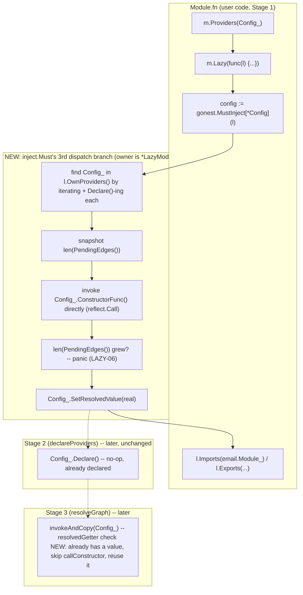

# Module Lazy Loading Design

**Spec**: `.specs/features/module-lazy-loading/spec.md`
**Status**: Draft

---

## Architecture Overview

`Module.Lazy(fn)` is NOT deferred the way `Module.New(fn)` itself is — it runs `fn(l)`
IMMEDIATELY, synchronously, the moment `Lazy` is called. This is safe and necessary
because `Module.Lazy` is called FROM INSIDE a module's own already-deferred `fn`
(`internal/module/assemble.go`'s `assemble` calls `m.fn(m)` during Stage 1's BFS walk,
then immediately reads `m.imports` to continue the walk — see `assemble.go:43-63`).
`Imports`/`Providers`/`Exports` are themselves just synchronous slice-appends already;
`Lazy` fits the exact same timing, it just ALSO runs its callback body immediately
instead of only appending.

The one genuinely new mechanism is `MustInject[T](l)`'s eager, synchronous construction
path — everything else re-uses machinery that already exists for a different purpose:



---

## Code Reuse Analysis

### Existing Components to Leverage

| Component | Location | How to Use |
| --- | --- | --- |
| `Provider.Declare()` | `internal/provider/provider.go:63` | Already idempotent ("no-op on any call after the first") — calling it early, during `Lazy`, for every own-module provider (to learn their `ResolvedType()`) is exactly what it was designed to tolerate |
| `Provider.ConstructorFunc()`/`Constructor` signature handling | `internal/provider/provider.go:168`, mirrored by `internal/resolver/stage3.go`'s `callConstructor` | The 4-signature invocation logic (`func() T` / `func() (T,error)` / `func(ctx) T` / `func(ctx) (T,error)`) is duplicated (not imported — see Tech Decisions for why) into `internal/inject`, same pattern `internal/resolver` already uses for its own private `constructable`/`scoped` mirrors of `*Provider`'s exported methods |
| `Provider.SetResolvedValue`/`ResolvedValue` | `internal/provider/provider.go:126,139` | Used exactly as designed: `SetResolvedValue` right after eager-invoking Constructor; Stage 3's `invokeAndCopy` reads `ResolvedValue()` first (NEW check) before falling back to `callConstructor` |
| `inject.PendingEdges()` | `internal/inject/inject.go:85` | Used as a before/after snapshot to detect LAZY-06 (provider's Constructor calling `MustInject` itself) — no new bookkeeping needed, just 2 length reads around the eager `Call` |
| `Module.Imports`/`Module.Exports` (existing, unchanged) | `internal/module/module.go:165,195` | `LazyModule.Imports`/`Exports` are 1-line delegations to the owning `*Module`'s own methods — zero new storage |
| `Module.OwnProviders()` | `internal/module/module.go:240` | `LazyModule` searches this (defensive copy, already exists) to find the target provider by (post-`Declare()`) `ResolvedType()` |

### Integration Points

| System | Integration Method |
| --- | --- |
| `internal/module` | New file `lazy.go`: `LazyModule` struct (`owner *Module`), `Module.Lazy(fn func(*LazyModule))` (calls `fn` immediately), `LazyModule.Imports`/`Exports` (delegate to `owner`) |
| `internal/inject` | `Must[T]`'s dispatch gains a 3rd branch: `if lm, ok := owner.(*module.LazyModule); ok { ... }`, checked BEFORE the `directResolver` branch (a `*LazyModule` never satisfies `directResolver`, order is not load-bearing, but logically Lazy is its own resolution mode, not a variant of direct resolution) |
| `internal/resolver/stage3.go` | `invokeAndCopy` (Singleton path ONLY — `invokeAndCopyEdge`/Transient path is untouched, LAZY-07 already forbids non-Singleton Lazy providers so this never applies there) gains one new check before `callConstructor`: if the node already has a `ResolvedValue()`, reuse it instead of invoking `Constructor` again |
| `gonest.go` | `LazyModule = module.LazyModule` (root alias, same rationale as every other root-aliased type — see `ProviderRef`'s own doc comment) |

---

## Components

### `LazyModule` (new, `internal/module/lazy.go`)

- **Purpose**: The callback argument to `Module.Lazy`, exposing `Imports`/`Exports`
  (delegating to the owning `*Module`) and acting as the dispatch target
  `inject.Must[T]` recognizes for eager, same-module-only resolution.
- **Location**: `internal/module/lazy.go` (new file), `internal/module/lazy_test.go` (new)
- **Interfaces**:
  - `func (m *Module) Lazy(fn func(l *LazyModule))` — constructs `&LazyModule{owner: m}`,
    calls `fn(l)` immediately (NOT deferred)
  - `func (l *LazyModule) Imports(mods ...*Module)` — `l.owner.Imports(mods...)`
  - `func (l *LazyModule) Exports(refs ...ExportableRef)` — `l.owner.Exports(refs...)`
  - `func (l *LazyModule) OwnProviders() []ProviderRef` — `l.owner.OwnProviders()`,
    exposed so `internal/inject` (which only holds a `*LazyModule`, not the underlying
    `*Module` — `owner` is unexported) can search for the target provider
- **Dependencies**: none beyond the existing `Module` type it wraps
- **Reuses**: `Module.Imports`/`Exports`/`OwnProviders`, unchanged

### `inject.Must[T]`'s Lazy dispatch branch (modification, `internal/inject/inject.go`)

- **Purpose**: Implements LAZY-02/05/06/07/08 — the eager, synchronous, self-contained-
  only construction path.
- **Location**: `internal/inject/inject.go`, new branch inside `Must[T]`, checked before
  the existing `directResolver` branch
- **Logic**:
  1. `t.Kind() != reflect.Pointer` → panic (mirrors the existing Provider-to-Provider
     pointer-only requirement; `Lazy` injection is scoped to concrete config-like types
     exactly like the spec's own examples, not interfaces)
  2. For each `p := range lm.OwnProviders()`: call `p.(declarable).Declare()` (new local
     duck-typed interface `declarable { Declare() }`, mirroring `internal/app`'s own
     `declarable` used by `declareProviders` — see Tech Decisions for why this can't be
     shared directly) — populates `ResolvedType()` for every own-module provider so they
     can be matched by type
  3. Find the (at most one — 2+ own-module providers resolving to the same exact type is
     already an unsupported/undefined scenario elsewhere in this codebase, not newly
     introduced here) provider whose `ResolvedType() == t`; not found → panic (LAZY-05)
  4. If that provider already has a resolved value (`resolvedGetter.ResolvedValue()`
     returns `ok=true` — LAZY-08, repeat injection) → return it directly, skip 5-8
  5. `p.(scoped).ResolvedScope() != scope.Singleton` → panic (LAZY-07)
  6. Snapshot `before := len(PendingEdges())`
  7. Invoke `p.(constructable).ConstructorFunc()` directly via `reflect.Call` (same 4-
     signature handling `callConstructor` uses — context arg detection, 1 vs 2 return
     values, panic-to-error not needed here since this runs at bootstrap/var-init-
     adjacent time, a raw panic propagating up through `Lazy`'s `fn` is the correct,
     consistent failure mode, unlike Stage 3's concurrent errgroup context which NEEDS
     panic-to-error conversion to avoid crashing sibling goroutines)
  8. `len(PendingEdges()) != before` → panic (LAZY-06)
  9. `p.(resolvedSetter).SetResolvedValue(real)`
  10. Return `real.Interface().(T)`
- **Dependencies**: `internal/module` (already imported), 3 new local unexported duck-
  typed interfaces (`declarable`, `constructable`, `resolvedSetter` — names chosen to
  match `internal/resolver/stage3.go`'s existing private mirrors of the exact same
  `*provider.Provider` methods, for readability/precedent, NOT shared by import)
- **Reuses**: `PendingEdges()` (existing), the exact same 4-signature Constructor-
  invocation shape already validated by `provider.Constructor`'s own
  `isValidConstructorSignature`

### Stage 3 skip-if-already-resolved check (modification, `internal/resolver/stage3.go`)

- **Purpose**: LAZY-03 — the eagerly-resolved provider's `Constructor` never runs twice.
- **Location**: `invokeAndCopy` (Singleton path only), right after the existing
  `overrideFor` check
- **Change**:
  ```go
  real, overridden := overrideFor(overrides, node)
  if !overridden {
      if rg, ok := node.(resolvedGetter); ok {
          if v, has := rg.ResolvedValue(); has {
              real, overridden = v, true
          }
      }
  }
  if !overridden {
      real, err = callConstructor(ctx, node)
      ...
  }
  ```
  `resolvedGetter` already exists in this file (used by `direct.go` via a duplicate
  local declaration — this reuses stage3.go's own copy, already present for
  `SetResolvedValue`'s doc comment cross-reference). Before this feature, `ResolvedValue()`
  could only ever return `ok=false` at this point in Stage 3 (nothing sets it earlier)
  — so this check is a pure no-op for every provider EXCEPT one that went through the
  new Lazy eager-resolution path. Zero behavior change for the entire rest of the
  codebase.
- **Dependencies**: none new
- **Reuses**: `overrideFor`'s existing "skip real Constructor, use this value" pattern —
  same shape, different source

---

## Data Models

Not applicable — this feature adds no persisted or transmitted data, only in-memory DI
graph bookkeeping types.

---

## Error Handling Strategy

| Error Scenario | Handling | User Impact |
| --- | --- | --- |
| `MustInject[T](l)` with no matching own-module provider | Immediate panic, names `T`, states Lazy only sees this module's own `Providers(...)` registered earlier in the same `fn` | Fails at bootstrap (`NewApp`/`MustNewApp` call time), inside the panicking `fn` — same failure class as every other bootstrap-time gonest panic |
| Matched provider's `Constructor` records a new `PendingEdge` during eager invocation | Panic naming the provider's type and stating Lazy only supports self-contained providers | Fails at bootstrap, message distinguishes this from "not found" |
| Matched provider is not `ScopeSingleton` | Panic naming the type and its actual scope | Fails at bootstrap |
| Matched provider's `Constructor` itself panics (e.g. malformed `.env` value) | Propagates as-is (NOT converted to an `error`, unlike Stage 3's `callConstructor` — see Components' step 7 rationale) | Fails at bootstrap with the ORIGINAL panic message/stack, not a wrapped generic one — acceptable since `Lazy`'s `fn` already runs inside `assemble`'s synchronous walk, itself inside `NewApp`'s own call stack, no goroutine boundary to cross |
| Repeated `MustInject[T](l)` for the same already-resolved type | No error — returns the cached value (LAZY-08) | Transparent, same value every time |

---

## Tech Decisions (only non-obvious ones)

| Decision | Choice | Rationale |
| --- | --- | --- |
| Where does the eager-construction logic live? | `internal/inject`, not `internal/module` or `internal/resolver` | `internal/module` cannot import `internal/provider` (would cycle — `provider` already imports `module` for `Owner`). `internal/resolver` cannot be imported BY `internal/inject` (resolver already imports inject, for `PendingEdges()` — the reverse would cycle). `internal/inject` already imports `internal/module` only, and already owns `Must[T]`'s dispatch logic (the `directResolver` branch already lives here) — the natural, cycle-free home |
| Why duplicate `callConstructor`'s 4-signature invocation logic instead of extracting a shared helper? | Small (~15 lines), and the two call sites have genuinely different error-handling needs (Stage 3 converts panic→error for errgroup safety; Lazy wants a raw panic) — matches this codebase's existing precedent of duplicating small duck-typed interface declarations across `internal/resolver`/`internal/app` rather than forcing a shared package for a handful of lines |
| Why is the Lazy dispatch branch checked before `directResolver` in `Must[T]`? | Not load-bearing (a `*LazyModule` can never satisfy `directResolver` — different shape entirely) — ordering chosen purely for readability, "new/specialized path first" |
| Why can 2+ `MustInject[T](l)` calls for the SAME type reuse the cached value instead of re-invoking? | LAZY-08 — a `Lazy` callback might reasonably read the same config value twice (e.g. once for `Imports`, once for a log message) without the user needing to manually cache it themselves; re-invoking a second time would also violate "constructed exactly once" (LAZY-03/spec Goals) |
| Why is `MustInject[T](l)` restricted to pointer `T` (no interface support)? | Matches every real example (`*Config`) and Provider-to-Provider's own existing pointer-only rule (`inject.Must`'s `t.Kind() != reflect.Pointer` panic, unchanged code path for that owner type) — `Lazy` is about reading a concrete decided-at-bootstrap value, not about swappable interface implementations (that is `ProviderAs`'s job, a deliberately separate feature) |

---

## Migration Plan (for Tasks phase)

1. `LazyModule` + `Module.Lazy` (`internal/module/lazy.go`), unit-tested in isolation
   (LAZY-01, delegation correctness)
2. `inject.Must[T]`'s Lazy dispatch branch (`internal/inject/inject.go`) — LAZY-02,
   05, 06, 07, 08, unit-tested against a fake `*module.LazyModule`-shaped fixture
3. Stage 3's skip-if-already-resolved check (`internal/resolver/stage3.go`) — LAZY-03,
   proven via a real `NewApp`/`MustNewApp` integration test counting `Constructor`
   invocations
4. `gonest.LazyModule` root alias (`gonest.go`)
5. LAZY-04's full integration proof: a real 2-branch (`Lazy` picking module A vs B based
   on a config value) `NewApp` test, both branches exercised, comparing against the
   equivalent unconditional-`Imports` behavior
6. Migrate `.examples/notification-driver`: `notifier.Config_` (real `Schema`-validated
   `Provider`, `env:"NOTIFICATION_DRIVER"`) replaces the ad hoc `main.go` env read;
   `ModuleForRoot` removed; `AppModule_` (or `notifier.Module_`) wires via `Lazy`. Verify
   live via `curl` for both driver values (same pattern every previous example
   migration in this project has used)
7. `.specs/insight/PROVIDER.md` status blockquote updated to SHIPPED

---

## Tips

- Reused: `Provider.Declare/ConstructorFunc/SetResolvedValue/ResolvedValue` (all
  unchanged), `Module.Imports/Exports/OwnProviders` (unchanged), `PendingEdges()`
  (unchanged), `overrideFor`'s "skip real Constructor" pattern (mirrored, not modified).
- New: `LazyModule`, `Module.Lazy`, `inject.Must[T]`'s 3rd dispatch branch, 1 new check
  in `invokeAndCopy`.
- Confirm before Tasks: user approves this design, especially that `Lazy`-injected
  providers stay restricted to self-contained/`Singleton`-only (already confirmed via
  `AskUserQuestion` this session, but re-surfaced here since it is THE central
  constraint the whole design leans on).
