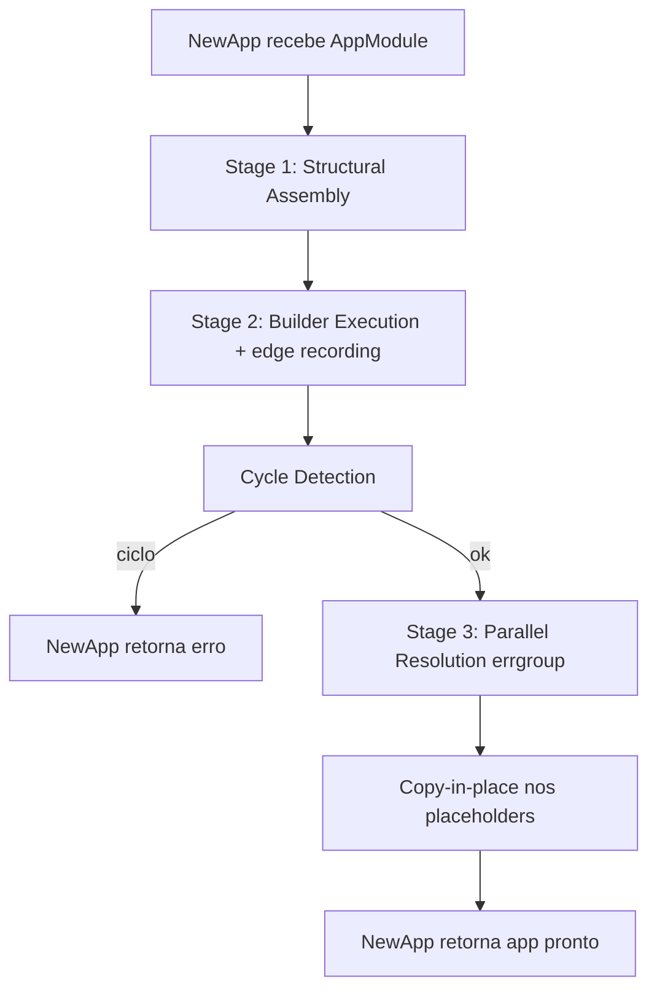

# Provider & DI Graph Design

**Spec**: `.specs/features/provider-di-graph/spec.md`
**Context**: `.specs/features/provider-di-graph/context.md`
**Status**: Draft

---

## Architecture Overview

Bootstrap roda em 3 estágios sequenciais dentro de `NewApp`. Nenhum builder callback (`NewModule(fn)`, `NewProvider(fn)`, `NewController(fn)`) executa no momento em que é chamado (`var X = gonest.NewXxx(fn)` roda em package-init, antes de existir qualquer `AppModule`/`NewApp`) — cada um só *guarda* `fn` e devolve um handle vazio. A execução real de `fn` é adiada pro bootstrap, que é o único momento em que dá pra saber "esse Controller pertence a este Module" (dependência de `MustResolve` no design do metadata builder: nunca assumir contexto que Go não consegue garantir em tempo de declaração).



**Stage 1 — Structural Assembly**: percorre `Imports` a partir de `AppModule` (BFS/DFS), executando o `fn` de cada `Module` uma única vez. Esse `fn` só chama `module.Imports/Providers/Controllers/Exports` — registro declarativo, sem tocar em `Provider`/`Controller` ainda. Resultado: árvore de módulos com, por módulo, lista de providers/controllers próprios + imports + exports.

**Stage 2 — Builder Execution**: agora que cada `Provider`/`Controller` sabe seu módulo dono, executa o `fn` de cada um (nessa ordem não importa, todos rodam nesse estágio — não é resolução, é só declaração). Dentro desse `fn`, toda chamada `gonest.MustResolve[T](self)` faz a busca de escopo (própria módulo → imports exportados) e devolve um **placeholder** (`reflect.New` do tipo apontado por `T`), registrando uma aresta de dependência `self → provider-de-T`. Controllers também registram `Route`/`Param`/`Handler` aqui, capturando os placeholders nos closures dos handlers.

**Stage 3 — Parallel Resolution**: com o grafo de arestas completo (só entre Providers — Controller não entra no grafo de resolução, só consome), roda detecção de ciclo (DFS colorindo nós). Sem ciclo, resolve via `errgroup`: cada `Provider` tem uma goroutine que espera (`chan struct{}` fechado) suas dependências, roda `Constructor`, e ao terminar faz `*placeholder = *real` (copy-in-place) e fecha seu próprio canal — isso libera quem dependia dele. Independentes disparam na hora, sem esperar ninguém.

---

## Code Reuse Analysis

Projeto greenfield (sem código Go ainda) — não há componente existente pra reusar. Base de referência é só o comportamento descrito no INSIGHT.md (exemplos de uso já validados como meta de DX).

### Integration Points

| Sistema                      | Como integra                                                                                                                                                                                                              |
| ---------------------------- | ------------------------------------------------------------------------------------------------------------------------------------------------------------------------------------------------------------------------- |
| `golang.org/x/sync/errgroup` | Stage 3 inteiro — cada goroutine de resolução é `group.Go(...)`; falha em qualquer uma cancela `context.Context` compartilhado                                                                                            |
| `context.Context`            | Passado opcionalmente pro `Constructor` (timeout de bootstrap); mesmo `ctx` usado pelo `errgroup.WithContext`                                                                                                             |
| `reflect`                    | Só em 2 pontos: (a) alocar placeholder de `T` (`MustResolve`) e (b) copy-in-place no fim da resolução — nunca pra inferir tipo de campo struct (isso já foi descartado no design do metadata builder, ver STATE.md L-001) |

---

## Components

**Layout de pacotes (revisado 2026-07-12, ver STATE.md AD-004):** cada tipo do grafo de DI vive no seu próprio pacote sob `internal/`, com um shim de re-export fino na raiz (`package gonest`). Isso resolve 2 problemas do design original (pacote único `gonest`): (a) colisão de compilação entre sub-agents concorrentes escrevendo tipos no mesmo pacote (ver STATE.md L-003), e (b) privacidade real — com tudo em `internal/scope`, `internal/module`, `internal/provider`, `internal/controller`, `internal/resolve`, campos não-exportados ficam de fato inacessíveis entre pacotes irmãos (só o que cada pacote exporta explicitamente é visível pros outros `internal/*`, que por sua vez só a raiz consegue importar — dupla barreira, não só a convenção de lowercase-privado de um pacote único). Import direction é sempre unidirecional: `provider`/`controller` podem importar `module` (pra implementar o contrato de ownership); `resolve` importa `module`+`provider`+`controller`; nenhum `internal/*` importa a raiz `gonest` de volta (evita ciclo).

### Module (container por módulo)

- **Purpose**: guarda providers/controllers próprios de um módulo, seus imports e o que exporta; unidade de escopo pro `MustResolve`. Define o contrato `Owner` (antigo `ownerModule` de T2, agora com tipo de retorno concreto `*Module` em vez de `any`).
- **Location**: `internal/module/module.go` (implementação) + `module.go` na raiz (re-export: `type Module = module.Module`, `var NewModule = module.New`)
- **Interfaces**:
  - `module.New(fn func(*Module)) *Module` — não executa `fn` na chamada
  - `(m *Module) Imports(mods ...*Module)`
  - `(m *Module) Providers(ps ...*Provider)`
  - `(m *Module) Controllers(cs ...*Controller)`
  - `(m *Module) Exports(ps ...*Provider)` — `ps` deve ser subconjunto do que `m` declarou em `Providers` (senão panic no Stage 1, erro de config)
  - `type Owner interface { OwnerModule() *Module }` — contrato exportado (dentro de `internal/module`, então só alcançável por outros pacotes `internal/*`, nunca por consumidor externo da lib) implementado por `Provider`/`Controller`
- **Dependencies**: nenhuma (é a raiz da árvore declarativa)
- **Reuses**: —

### Provider (declaração + instância)

- **Purpose**: representa 1 tipo resolvível; guarda `Scope`, `Constructor` e, após Stage 3, a instância real. Implementa `module.Owner`.
- **Location**: `internal/provider/provider.go` + `provider.go` na raiz (re-export)
- **Interfaces**:
  - `provider.New(fn func(*Provider)) *Provider`
  - `(p *Provider) Scope(s scope.Scope)` — `Singleton | Transient | Request`
  - `(p *Provider) Constructor(fn any)` — aceita `func() T`, `func() (T, error)`, `func(ctx context.Context) T`, `func(ctx context.Context) (T, error)` (variantes via reflect na hora de invocar)
  - `(p *Provider) OwnerModule() *module.Module` — implementa `module.Owner`
- **Dependencies**: `internal/scope` (tipo `Scope`), `internal/module` (tipo `*Module` + contrato `Owner`); outros `Provider`s resolvidos via `MustResolve` dentro do próprio `fn` (Stage 2)
- **Reuses**: mecanismo de placeholder do `MustResolve` (compartilhado com Controller)

### Controller (consumidor, não entra no grafo de resolução)

- **Purpose**: consome Providers via `MustResolve`; não é resolvido em si, só popula placeholders que usa. Implementa `module.Owner`.
- **Location**: `internal/controller/controller.go` + `controller.go` na raiz (re-export)
- **Interfaces**: (fora do escopo desta feature — ver "Controller & Route Registration"; aqui só interessa que ele participa do mesmo mecanismo de `MustResolve` e implementa `module.Owner`)
- **Dependencies**: `internal/module` (contrato `Owner`); Providers do próprio módulo + imports exportados
- **Reuses**: `MustResolve` / placeholder

### DI Resolver (motor interno, não-exportado)

- **Purpose**: implementa os 3 estágios — não é API pública, é o mecanismo que roda dentro de `NewApp`/`MustNewApp`.
- **Location**: `internal/resolver/resolver.go`
- **Interfaces**:
  - `resolver.Resolve(root *module.Module, opts AppOptions) (*ResolvedGraph, error)` — chamado por `NewApp`
- **Dependencies**: `internal/module`, `internal/provider`, `internal/controller`, `errgroup`, `context`, `reflect`
- **Reuses**: —

### MustResolve[T] (genérico público)

- **Purpose**: ponto único de acesso a dependência, usado dentro de `Provider.Constructor`'s builder fn e `Controller`'s builder fn.
- **Location**: `internal/resolve/resolve.go` (mecanismo real) + `resolve.go` na raiz (wrapper genérico público — Go não permite re-exportar função genérica via `var`, então é uma função real que chama a interna: `func MustResolve[T any](owner module.Owner) T { return resolve.MustResolve[T](owner) }`)
- **Interfaces**:
  - `MustResolve[T any](owner module.Owner) T`
- **Dependencies**: `internal/module` (tipo `Owner`/`*Module`); precisa que `T` seja tipo ponteiro (`*Struct`) — não há como o Go checar isso em compile-time com um type param só; validado via `reflect.TypeOf` em runtime, panic claro se `T` não for ponteiro (ver Tech Decisions)
- **Reuses**: nada — é o ponto de entrada que aciona o registro de aresta + alocação de placeholder

---

## Data Models

Não há modelo de dado persistido nessa feature — só estruturas internas de grafo:

```go
type providerNode struct {
    typeKey      reflect.Type // tipo *T que esse provider resolve
  ownerModule  *Module
  scope        Scope
  constructor  reflect.Value // fn do usuário
  deps         []*providerNode // arestas registradas no Stage 2
  placeholder  reflect.Value // *T alocado, devolvido em MustResolve
  instance     reflect.Value // *T real, populado no Stage 3
  done         chan struct{} // fechado quando instance está pronto (ou err setado)
  err          error
}
```

**Relationships**: `deps` forma o grafo dirigido usado tanto pra detecção de ciclo (DFS) quanto pra ordem de disparo no `errgroup` (goroutine de um node só chama `Constructor` depois de `<-dep.done` de todos os `deps`).

---

## Error Handling Strategy

| Cenário                                                                     | Tratamento                                                                                     | Impacto pro dev                                                                                           |
| --------------------------------------------------------------------------- | ---------------------------------------------------------------------------------------------- | --------------------------------------------------------------------------------------------------------- |
| Ciclo entre providers (A→B→A)                                               | DFS de cores no Stage 2 (antes do errgroup rodar) detecta e monta a cadeia do ciclo            | `NewApp` retorna erro `"circular dependency: A -> B -> A"`, nada de deadlock                              |
| `MustResolve[T]` de tipo não registrado em lugar nenhum                     | Stage 2 falha a busca (módulo + imports exportados vazios)                                     | panic imediato: `"gonest: no provider registered for type *X"`                                            |
| `MustResolve[T]` de tipo que existe mas não é exportado pro módulo que pede | Stage 2 distingue esse caso do anterior (tipo existe na árvore, só não alcançável)             | panic: `"gonest: type *X exists in module Y but is not exported"`                                         |
| `Constructor` retorna `error`                                               | goroutine desse node seta `err`, fecha `done`, cancela `context.Context` do `errgroup`         | `NewApp`/`MustNewApp` retorna/panica com esse erro; demais goroutines em andamento são canceladas via ctx |
| `Constructor` panica                                                        | `recover()` na goroutine do `errgroup.Go`, convertido em `error` e tratado igual ao caso acima | mesmo comportamento — nunca derruba o processo direto                                                     |
| `T` passado pra `MustResolve[T]` não é ponteiro                             | checagem via `reflect.TypeOf` logo na entrada da função, antes de qualquer busca               | panic imediato: `"gonest: MustResolve[T] requires T to be a pointer type, got X"`                         |
| Módulo tenta `Exports` provider que não declarou em `Providers`             | validado no fim do Stage 1 pra esse módulo                                                     | `NewApp` retorna erro: `"module X exports provider *Y it does not declare"`                               |

---

## Tech Decisions (only non-obvious ones)

| Decisão                                                            | Escolha                                                                                           | Racional                                                                                                                                                                    |
| ------------------------------------------------------------------ | ------------------------------------------------------------------------------------------------- | --------------------------------------------------------------------------------------------------------------------------------------------------------------------------- |
| Quando builder `fn` executa                                        | Adiado pro bootstrap (Stage 1/2), nunca na chamada de `NewModule/NewProvider/NewController`       | É o único jeito de `MustResolve` saber o módulo dono — na chamada direta (package init) essa info não existe ainda                                                          |
| Como alocar placeholder pra `T` genérico sendo já um tipo ponteiro | ~~`reflect.New(reflect.TypeOf((*T)(nil)).Elem().Elem())`~~ **corrigido em T6** (evaluator verificou empiricamente que a fórmula original inverte o `Kind()` — trata `*S` válido como se fosse struct e causa panic não-recuperável de `reflect: Elem of invalid type` no caso `T=S` que devia gerar o panic limpo do framework): usar `var zero T; t := reflect.TypeOf(&zero).Elem()` (dá o `reflect.Type` do próprio `T` em qualquer caso) → checar `t.Kind() == reflect.Pointer`, alocar via `reflect.New(t.Elem())`, cast via `.Interface().(T)` | Go generics não permite `new()` derivar o tipo apontado a partir de um type param que já é `*Struct`; único jeito é reflect nesse ponto específico (não em todo o resolver) |
| Granularidade do paralelismo no Stage 3                            | Por nó (channel `done` por provider), não por camada topológica                                   | Mais fiel ao `Promise.all` do Nest — um provider começa assim que SUAS deps terminam, não espera a "geração" inteira. Custo de implementação é baixo (1 channel por node)   |
| Escopo de resolução (`MustResolve`)                                | Próprio módulo → imports exportados, nunca a partir da raiz                                       | Decisão do usuário em context.md — replica encapsulamento real de módulo do Nest, não container global                                                                      |
| Controller não entra no grafo de ciclo/paralelismo                 | Correto — Controller só consome, nunca é dependência de ninguém                                   | Simplifica DFS de ciclo (só entre Providers) sem perder cobertura, já que Controller nunca aparece do lado "dependido" de uma aresta                                        |

---

## Open Questions pra Tasks

- Scope `Request` (P3): mecanismo de "request context" isolado precisa de uma interface mínima (`type RequestScope interface { ... }`) que ainda não existe — Tasks deve criar essa interface como stub testável, sem acoplar ao Pipeline real (que só chega no Milestone 3).
- Mensagem exata de erro de ciclo com cadeia completa (A -> B -> C -> A) exige guardar o caminho durante o DFS, não só "achei ciclo" — Tasks deve tratar isso como critério de aceite explícito (bate com DI-08).
