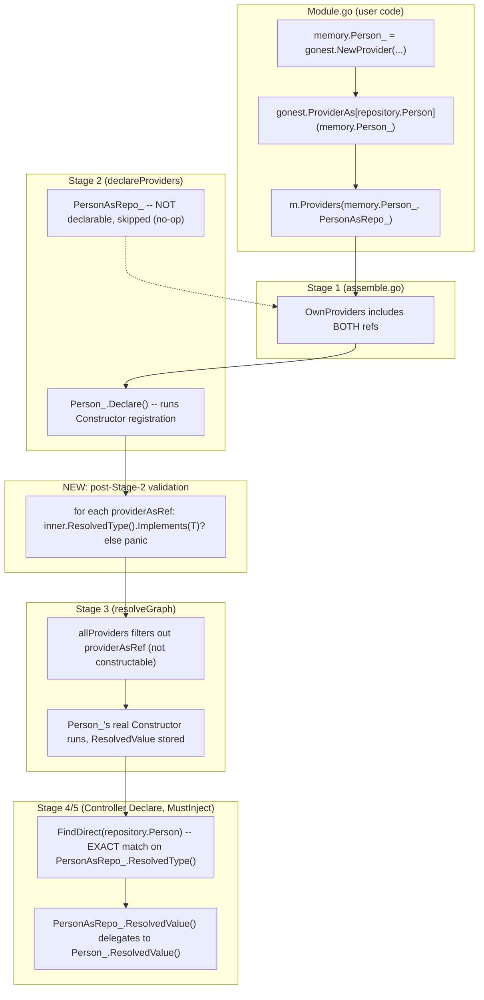

# Provider Interface Export Design

**Spec**: `.specs/features/provider-interface-export/spec.md`
**Status**: Draft

---

## Architecture Overview

Today, an interface `T` resolves against whatever concrete `*provider.Provider`
structurally satisfies it (`reflect.Type.Implements()`), checked at 2 independent
points: `internal/resolver/direct.go`'s `findDirectMatches` (production
`MustInject[T]`/`MustInjectAll[T]` from Controller/Middleware/Guard/Interceptor/
Filter) and `internal/resolver/stage3.go`'s `overrideFor` (test-double overrides in
`MustNewTestApp` — a genuinely separate mechanism, untouched by this feature).

This feature makes the FIRST of those two explicit. A new wrapper type
(`providerAsRef`, `internal/module`) stands in for a concrete `ProviderRef` but
reports `TInterface` as its own `ResolvedType()` — so the SAME exact-match code path
`findDirectMatches` already uses for pointer types now also handles interfaces,
without any structural fallback. The wrapper is a thin, read-only VIEW: it never
drives Stage 3 construction itself (only the concrete registration does), it only
exists so `FindDirect`/`FindDirectAll`'s existing exact-match scan can find `T`.

---

## Code Reuse Analysis

### Existing Components to Leverage

| Component | Location | How to Use |
| --- | --- | --- |
| `module.ProviderRef` interface | `internal/module/module.go:38` | `providerAsRef` implements it unchanged — no interface changes needed |
| `findDirectMatches` exact-match branch | `internal/resolver/direct.go:65-73` | Already does exactly what an explicit interface mapping needs (`p.ResolvedType() != t → continue`) — the Implements() fallback block (lines 77-92) is DELETED, the exact-match branch is untouched and now serves both pointer AND interface lookups |
| `resolvedGetter` duck-typed interface | `internal/resolver/direct.go:16-18` | `providerAsRef` implements `ResolvedValue() (reflect.Value, bool)` structurally (same method name/signature) so `resolvedValueOf` picks it up with zero changes to `direct.go` beyond the deletion above |
| `constructable` duck-typed interface | `internal/resolver/stage3.go:22-24` | `providerAsRef` deliberately does NOT implement this — used as the exclusion signal in Stage 3's filtering (Component 4 below) |
| `unified-exportable-refs`'s `ExportableRef`/`Module.Exports` | `internal/module/module.go:18-20, 195` | `providerAsRef` embeds/satisfies `ExportableRef` (via `ProviderRef`) unchanged — passing the same wrapper value to both `Providers` and `Exports` already works today for any `ProviderRef` |
| `declarable` duck-typed interface | `internal/app/app.go:812-814` | `providerAsRef` deliberately does NOT implement `Declare()` — `declareProviders` already treats non-declarable refs as a silent no-op (`if d, ok := p.(declarable); ok`), so no change needed there |

### Integration Points

| System | Integration Method |
| --- | --- |
| `internal/app`'s bootstrap sequence (`NewApp`/`MustNewApp`) | New call inserted between `declareProviders` (Stage 2) and `resolver.Resolve` (Stage 3): `validateProviderAsRefs(modules)` |
| `internal/resolver/stage3.go`'s `allProviders` | Filters out any `ProviderRef` implementing a new internal `isProviderAsView` marker before returning the slice `resolveGraph` iterates |
| `gonest.go` | New public generic wrapper `ProviderAs[T any](ref ProviderRef) ProviderRef` delegating to `module.ProviderAs[T](ref)` (mirrors `MustInject`'s own "Go cannot re-export a generic function via var" comment/pattern) |

---

## Components

### `providerAsRef` (new, unexported)

- **Purpose**: Wraps an existing `ProviderRef`, reporting a caller-chosen interface
  type as its own `ResolvedType()`, while delegating actual value resolution to the
  wrapped ref.
- **Location**: `internal/module/provider_as.go` (new file)
- **Interfaces implemented**:
  - `IsProvider()` / `IsExportable()` — trivial markers, satisfies `ProviderRef`
  - `ResolvedType() reflect.Type` — returns the interface type `T` this view was
    constructed for (captured via `reflect.TypeFor[T]()` inside `ProviderAs[T]`,
    stored as a plain field — NOT computed from the wrapped ref, so it is valid
    immediately, unlike the wrapped ref's own `ResolvedType()`)
  - `SetOwnerModule(m *Module)` / `OwnerModule() *Module` — own storage, set
    independently by Stage 1 assembly when the wrapper itself is registered
  - `ResolvedValue() (reflect.Value, bool)` — duck-typed to satisfy
    `internal/resolver`'s unexported `resolvedGetter`; delegates: if the wrapped
    `ref` itself satisfies a local `hasResolvedValue` interface (structurally
    identical signature), returns its result; otherwise `(reflect.Value{}, false)`
  - `isProviderAsView()` — new unexported marker, ONLY for Stage 3's exclusion
    filter (Component 4) and the post-Stage-2 validator (Component 3) to
    type-assert against; deliberately not part of any existing exported interface
  - `innerRef() ProviderRef` — unexported accessor Component 3 needs to reach the
    wrapped ref's `ResolvedType()` for the deferred implements-check
- **Dependencies**: none beyond `reflect` and the existing `module` package types
  it lives alongside
- **Reuses**: `ProviderRef`'s existing shape entirely — no interface changes

### `ProviderAs[T any]` (new, generic free function)

- **Purpose**: Public entry point constructing a `providerAsRef`.
- **Location**: `internal/module/provider_as.go` (same file as the type), re-exported
  from `gonest.go` as `gonest.ProviderAs[T any](ref ProviderRef) ProviderRef`
- **Interfaces**:
  - `func ProviderAs[T any](ref ProviderRef) ProviderRef` — stores
    `reflect.TypeFor[T]()` and `ref` on a new `providerAsRef`, returns it. Does
    `T`'s kind have to be an interface? Yes — panics immediately
    (`"gonest: ProviderAs[T] requires T to be an interface type, got %s"`) if not;
    this check IS safe to run at call time (var-init) since it only inspects `T`
    itself via `reflect.TypeFor[T]()`, never `ref`'s state
- **Dependencies**: none beyond `reflect`
- **Reuses**: nothing new — this is the constructor for Component 1

### `validateProviderAsRefs` (new, internal/app)

- **Purpose**: The deferred "does the wrapped ref actually implement T" check —
  the one validation that CANNOT run inside `ProviderAs` itself (see spec.md's
  corrected timing rationale: a `*provider.Provider`'s `ResolvedType()` is `nil`
  until `Declare()` has run, which only happens at Stage 2, inside `NewApp`).
- **Location**: `internal/app/app.go`, called from `NewApp`/`MustNewApp` right after
  `declareProviders(modules)` and before `resolver.Resolve(ctx, modules)`
- **Interfaces**:
  - `func validateProviderAsRefs(modules []*module.Module) error` — walks every
    module's `OwnProviders()`, type-asserts each against the `isProviderAsView`
    marker (Component 1), and for each match calls `inner.ResolvedType()`; if nil
    (satisfies PROVAS-08 — inner concrete was never separately `Declare()`d because
    it was never registered via `Providers` in the first place) OR non-nil but
    `!Implements(T)`, returns a descriptive error naming both types and, for the
    nil case, explicitly stating the concrete ref needs its own `Providers(...)`
    registration
- **Dependencies**: `internal/module` (for the marker/accessor types)
- **Reuses**: the exact same "walk `OwnProviders()` across every module" traversal
  `declareProviders`/`allProviders` already use — no new traversal primitive

### Stage 3 exclusion filter (modification, `internal/resolver/stage3.go`)

- **Purpose**: Prevent `callConstructor`'s existing hard error
  (`"does not expose a Constructor"`) from firing for `providerAsRef` values, WITHOUT
  weakening that error for any other genuinely-broken `ProviderRef` (PROVAS-09).
- **Location**: `internal/resolver/stage3.go`'s `allProviders` (line 263)
- **Change**: add one skip check inside the existing loop —
  `if _, ok := p.(isProviderAsView); ok { continue }` — using the SAME unexported
  marker interface Component 3 uses (structural match works across packages without
  an import, `internal/resolver` already declares its own private copies of
  `constructable`/`scoped`/`resolvedSetter` this exact way for `*provider.Provider`)
- **Dependencies**: none new
- **Reuses**: the existing dedup-by-identity loop, unchanged in every other respect

### `findDirectMatches` simplification (modification, `internal/resolver/direct.go`)

- **Purpose**: Remove the implicit `Implements()` fallback (PROVAS-02).
- **Location**: `internal/resolver/direct.go:76-92`
- **Change**: delete the `if t.Kind() != reflect.Interface { return nil }` /
  `implementing` block entirely. The function becomes: try exact match, return it
  (0 or more); nothing else. A `providerAsRef`'s `ResolvedType()` being exactly `T`
  means this exact-match branch alone already resolves it — the deleted block is
  now genuinely dead weight, not a fallback anything still needs.
- **Note on the exact-match-with-2-matches case**: `FindDirect` (singular, used for
  pointer T today) already treats 2+ exact matches as "not found" — this is now
  ALSO how 2 different `ProviderAs[T]`-wrapped refs for the same `T` in one scope
  behave (PROVAS-06), consistent with `FindDirectAll`'s pre-existing
  ambiguity-via-count contract used by `MustInject`

---

## Data Models

Not applicable — this feature adds no persisted or transmitted data, only in-memory
DI graph bookkeeping types.

---

## Error Handling Strategy

| Error Scenario | Handling | User Impact |
| --- | --- | --- |
| `ProviderAs[T]` called with a non-interface `T` | Immediate panic at call time (var-init) | Fails at package load, message names `T` |
| Wrapped ref's concrete type does not implement `T` | Panic in `validateProviderAsRefs`, surfaced as an `error` returned from `NewApp`/`MustNewApp` (`MustNewApp` panics on any non-nil error, matching its existing contract) | Fails at app bootstrap, message names both the concrete type and `T` |
| Wrapped ref never separately registered via `Providers` | Same `validateProviderAsRefs` path — `inner.ResolvedType()` is `nil` because `Declare()` never ran for it | Fails at app bootstrap, message explicitly calls out the missing registration (distinct wording from the "wrong type" case above) |
| 2 different `ProviderAs[T]`-wrapped refs for the same `T` in one resolution scope | `MustInject[T]` panics with the existing ambiguity message (`"ambiguous: N providers implement interface..."`) — unchanged wording, now reached via exact-match count instead of Implements()-match count | Same panic message shape users already see today for 2 structurally-matching providers |
| `ProviderAs[A](ProviderAs[B](ref))` (chaining) | Rejected: `ProviderAs[T]` panics if `ref` already satisfies `isProviderAsView` (`"gonest: ProviderAs cannot wrap another ProviderAs view — wrap the original concrete ProviderRef for each interface instead"`) — resolves PROVAS-05 by explicit rejection, since a wrapper's own `ResolvedType()` is `T`, not the original concrete type, so "does the ORIGINAL concrete type implement A" can't be answered by chaining through B's view | Fails at call time (var-init) — this check only inspects `ref`'s own kind, same as the `T`-must-be-interface check, safe to run immediately |

---

## Tech Decisions (only non-obvious ones)

| Decision | Choice | Rationale |
| --- | --- | --- |
| Where does `providerAsRef` live? | `internal/module`, not `internal/provider` | It only needs `module.ProviderRef`'s existing shape (duck-typed, no concrete `*provider.Provider` dependency) — living in `internal/module` avoids a new import edge and matches how `ProviderRef`/`ExportableRef` themselves are already declared there specifically to stay implementation-agnostic |
| Validation timing | Deferred to a new post-Stage-2 pass in `internal/app`, not inside `ProviderAs` itself | Corrected mid-design after confirming `*provider.Provider.ResolvedType()` is `nil` until `Declare()` runs (Stage 2) — `ProviderAs` executes at var-init, long before Stage 2. Still fails at `NewApp` call time (well before any request), just not literally "before main" |
| Stage 3 exclusion mechanism | Structural marker (`isProviderAsView`) checked in `allProviders`, not a change to `callConstructor`'s error behavior | Keeps `callConstructor`'s hard error meaningful for actual invariant violations (any OTHER non-constructable `ProviderRef` reaching Stage 3 is still a real bug) — the exclusion is scoped precisely to the one new legitimate case, not a blanket softening |
| Chaining (`ProviderAs` wrapping another `ProviderAs`) | Rejected outright, not silently supported | A wrapper's `ResolvedType()` is the interface, not the original concrete type — supporting chaining would either lose the ability to validate against the TRUE concrete type or require walking an arbitrary chain of wrappers; rejecting is simpler and matches this project's "fail loud" precedent (STATE.md, `fiberMethod`'s switch-to-panic fix) over silently guessing intent |
| `internal/resolver/stage3.go`'s `overrideFor` (test override Implements() matching) | Left unchanged, out of scope | A genuinely separate mechanism (test doubles for `MustNewTestApp`, not production interface resolution) — conflating the two would mean test overrides ALSO require explicit `ProviderAs` wrapping, which nothing in this spec's user stories asks for and would be a much larger, unrequested change to the test-app-bootstrap feature |

---

## Migration Plan (for Tasks phase)

1. Add `providerAsRef` + `ProviderAs[T]` (`internal/module`), unit-tested in
   isolation (PROVAS-01, PROVAS-05)
2. Add `validateProviderAsRefs` (`internal/app`), wire into `NewApp`/`MustNewApp`
   bootstrap sequence (PROVAS-08)
3. Modify `stage3.go`'s `allProviders` (exclusion filter, PROVAS-09)
4. Modify `direct.go`'s `findDirectMatches` (delete Implements() fallback, PROVAS-02,
   PROVAS-06)
5. Add `gonest.ProviderAs[T]` public wrapper (`gonest.go`)
6. Rewrite the 6 `internal/resolver/direct_test.go` tests + `gonest_test.go`'s
   multi-binding tests against explicit `ProviderAs` registration (Migration Impact)
7. Migrate `.examples/notification-driver` to `ProviderAs[port.Notifier]`, verify
   live via the existing `curl` smoke test pattern this repo always uses before
   calling a feature done
8. Document the `Thing_` naming convention (NAMING-01) — exact doc location decided
   at Tasks time (README.md vs a new CONVENTIONS note), explicitly flagged for
   later reflection into `C:\dev\gonest-dev\site` per the user's stated intent

---

## Tips

- Reused: `ProviderRef`'s existing shape, `resolvedGetter`/`constructable`/
  `declarable`'s existing duck-typing convention, `findDirectMatches`'s exact-match
  branch, `unified-exportable-refs`'s dual-accept `Exports` signature.
- New: `providerAsRef`, `ProviderAs[T]`, `validateProviderAsRefs`, 1 new field-check
  line in `allProviders`, 1 deleted block in `findDirectMatches`.
- Confirm before Tasks: user approves this design, especially the corrected
  validation-timing decision (was "var-init panic", now "post-Stage-2 panic").
