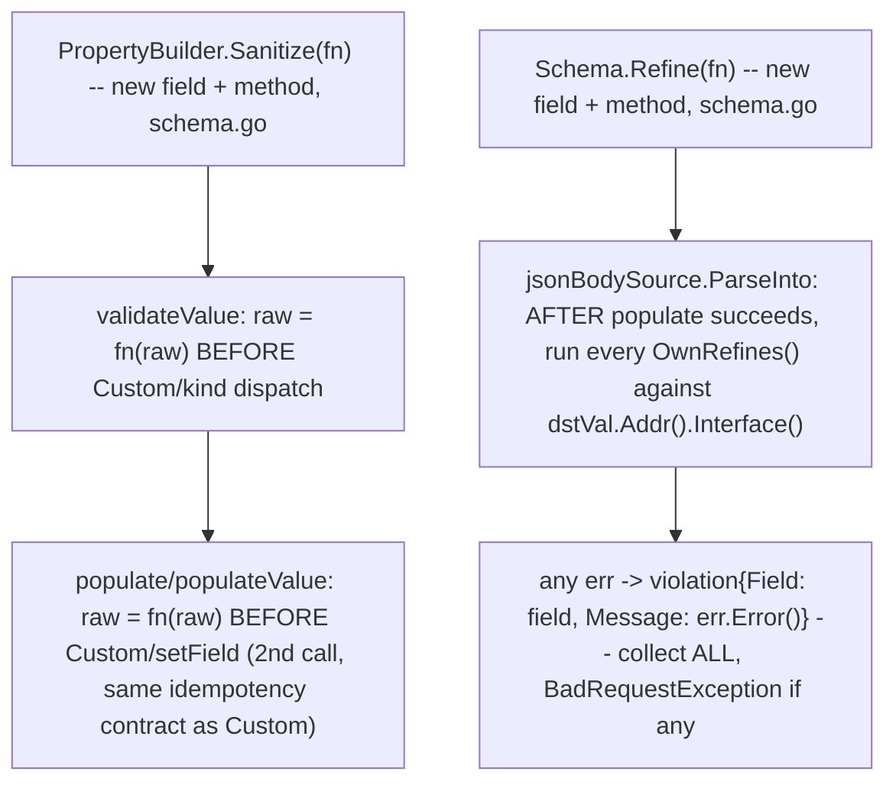

# Schema Sanitize/Refine Design

**Spec**: `.specs/features/schema-sanitize-refine/spec.md`
**Status**: Draft

---

## Architecture Overview

Reuses 100%: `validateValue`/`setField`/`BadRequestException`/`violation`
(all pre-existing). New surface: 1 field + 2 methods on `PropertyBuilder`
(`Sanitize`/`SanitizeFunc`), 1 field + 2 methods on `Schema` (`Refine`/
`OwnRefines`), and their application inside `internal/validate` (4 small
edits: `validateValue`'s top, `populate`'s per-field loop, `populateValue`,
`jsonBodySource.ParseInto`'s tail).

---

## Code Reuse Analysis

### Existing Components to Leverage

| Component | Location | How to Use |
| --------- | -------- | ---------- |
| `PropertyBuilder.Custom`/`CustomFunc` (bool-return getter pattern) | `internal/schema/schema.go:566-594` | `Sanitize`/`SanitizeFunc` follow the IDENTICAL shape: bare `*PropertyBuilder` return (no wrapper), `func(raw any) any` stored field, bool-return getter |
| `validateValue`'s Custom-first dispatch | `internal/validate/validate.go:231-254` | `Sanitize` is applied ONE line above the existing Custom check -- `raw` reassigned before anything else reads it |
| `populate`'s per-field Custom-then-setField flow | `internal/validate/validate.go:454-486` | Same reassignment applied before the existing Custom-then-setField block, mirroring `validateValue`'s own placement |
| `populateValue` (schema-value-support feature, T5) | `internal/validate/validate.go` | Same reassignment applied at its own top, for symmetry (Value-schema fields CAN use Sanitize even though Refine is Out of Scope for Value-schemas -- these are independent features) |
| `violation`/`exception.NewBadRequestException` | `internal/validate/validate.go` | `Refine`'s failures become `violation{Field: field, Message: err.Error()}`, collected the same way `validateStruct` already collects field violations |
| `OwnProperties()`'s defensive-copy pattern | `internal/schema/schema.go:146-152` | `OwnRefines()` mirrors this exactly -- copy slice, no shared mutable state leak |

### Integration Points

| System | Integration Method |
| ------ | ------------------- |
| `internal/schema` (`PropertyBuilder`) | New field `sanitize func(raw any) any`, methods `Sanitize(fn) *PropertyBuilder` / `SanitizeFunc() (func(raw any) any, bool)` |
| `internal/schema` (`Schema`) | New field `refines []func(dst any) (string, error)`, methods `Refine(fn) *Schema` / `OwnRefines() []func(dst any) (string, error)` |
| `internal/validate` | `validateValue` (top), `populate` (per-field loop), `populateValue` (top) each gain a 3-line Sanitize-application block; `jsonBodySource.ParseInto` gains a post-`populate` Refine-running block (struct path only, `m.IsValue()` stays untouched) |

---

## Components

### `PropertyBuilder.Sanitize` (new -- `internal/schema/schema.go`)

- **Purpose**: Transform `raw` before any other check consumes it -- composes with built-in Min/Max/Pattern (unlike `Custom`, which replaces them).
- **Location**: `internal/schema/schema.go`, alongside `Custom`/`CustomFunc`
- **Interfaces**: `func (p *PropertyBuilder) Sanitize(fn func(raw any) any) *PropertyBuilder`, `func (p *PropertyBuilder) SanitizeFunc() (func(raw any) any, bool)`
- **Dependencies**: none
- **Reuses**: `Custom`'s exact shape (bare return, last-call-wins, no panic)

### `Schema.Refine` (new -- `internal/schema/schema.go`)

- **Purpose**: Register a cross-field check, run after all individual field validation and population succeed.
- **Location**: `internal/schema/schema.go`, alongside `Title`/`Description`
- **Interfaces**: `func (m *Schema) Refine(fn func(dst any) (field string, err error)) *Schema`, `func (m *Schema) OwnRefines() []func(dst any) (string, error)`
- **Dependencies**: none
- **Reuses**: `OwnProperties()`'s defensive-copy getter shape

### `internal/validate` integration (modified, not new)

- **Purpose**: Wire `Sanitize`/`Refine` into the existing validate/populate pipeline at the 4 points listed in Integration Points above.
- **Location**: `internal/validate/validate.go`
- **Dependencies**: `schema.PropertyBuilder.SanitizeFunc`, `schema.Schema.OwnRefines`
- **Reuses**: `violation`, `exception.NewBadRequestException`, `dstVal.Addr().Interface()` (already computed in `ParseInto`, just read again after `populate`)

---

## Tech Decisions

| Decision | Choice | Rationale |
| -------- | ------ | --------- |
| `Sanitize`'s signature: `func(raw any) any` (no error) vs `func(raw any) (any, error)` | No error -- pure transform | A sanitize step that can itself fail is really `Custom`'s job (which already supports failure); keeping `Sanitize` error-free keeps the two mechanisms cleanly separated (transform vs validate) |
| `Refine`'s signature: single `(field string, err error)` vs a `ctx`-style multi-issue callback (Zod's `superRefine`) | Single issue per `Refine` call -- call `Refine` multiple times for multiple checks | YAGNI -- multiple independent cross-field checks already compose naturally by calling `Refine` N times (same precedent as calling `Property` N times); a multi-issue context type would be a new exported type for a case with no concrete demand yet |
| `Refine` scope: JSON body only (jsonBodySource) vs all 5 Parseable sources | JSON body only in V1 | Params/query/form/headers each pre-coerce raw strings via `coerceParamString` with their own Custom-shortcut branch (4 subtly different shapes) -- extending Refine there is real but separate work, explicitly Out of Scope (spec.md) until a concrete use case appears |
| `Sanitize` scope: all sources or JSON body only | All sources where `Custom` already exists (`validateValue`/`populate`/`populateValue` are source-agnostic core functions) | Unlike `Refine`, `Sanitize`'s application point (`validateValue`'s top) is ALREADY shared by every source that calls it -- no extra per-source work needed, so there is no reason to artificially restrict it to JSON body |
| `Refine` order relative to `populate`'s per-field Custom | After `populate` returns (not interleaved) | `Refine` needs the FULLY populated `dst`, not a partially-populated one -- must run strictly after `populate`'s loop completes |

---

## Error Handling Strategy

| Error Scenario | Handling | Caller Sees |
| --------------- | -------- | ----------- |
| `Sanitize(fn)` panics | Not caught specially -- same as any other user-supplied callback in this package (`Custom`, `CustomFunc`) already documents no special recover; a panicking Sanitize propagates like a panicking Custom would | Same failure mode as an existing panicking `Custom(fn)` -- consistent, not a new risk category |
| `Refine(fn)` returns `err != nil` | Collected into `violation{Field: field, Message: err.Error()}`, same slice individual field violations would use if `validateStruct` had produced any -- but Refine's violations are collected in a SEPARATE pass (after populate), never mixed into the same collection call | `exception.NewBadRequestException(violations)` -- same shape as any other validation failure |
| Multiple `Refine` calls, more than one fails | ALL failing ones contribute a violation (collect-all, D5) | A single `BadRequestException` with N violations, one per failing `Refine` |
| `Refine` registered on a `Value`-schema (`m.IsValue() == true`) | Not invoked -- `jsonBodySource.ParseInto`'s Refine-running block is gated the same way the existing `if m.IsValue()` branch already short-circuits before reaching it (Refine block placed only in the struct path, after the early `return populateValue(...)`) | No error, no behavior -- silently a no-op (Out of Scope per spec.md's Edge Cases, not treated as a caller mistake worth a panic in this version) |

---

## Traceability to Spec

| Requirement ID | Design Component |
| --------------- | ---------------- |
| SANR-01 | `PropertyBuilder.Sanitize`/`SanitizeFunc`, `validateValue`/`populate`/`populateValue` integration |
| SANR-02 | `Schema.Refine`/`OwnRefines`, `jsonBodySource.ParseInto` integration |
| SANR-03 | No changes to `Custom`/`Property`/`New`/`NewValue` themselves -- verified by existing test suites passing unmodified |
