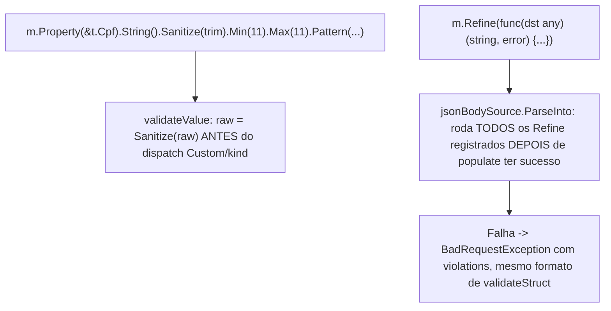

# Schema Sanitize/Refine Specification

## Problem Statement

`PropertyBuilder.Custom(fn)` é hoje a única porta de escape do Schema, e
ela SUBSTITUI por inteiro a validação built-in (Min/Max/Pattern nunca
rodam se `Custom` foi chamado), sempre no escopo de UM campo isolado, sem
acesso a outros campos do mesmo struct. Dois casos reais do dia a dia
(inspirados em `.preprocess()`/`.refine()` do Zod) não cabem nisso:

1. Sanitizar um valor ANTES da validação built-in rodar (ex: `trim()` num
   `string` antes de checar `Min(11)` -- sem isso, `"  12345678901  "`
   falha por tamanho mesmo sendo um CPF válido depois de aparado).
2. Comparar 2+ campos DEPOIS que cada um passou individualmente (ex:
   `password == confirmPassword` -- nenhum campo isolado sabe disso, só o
   struct inteiro sabe).

Reflexão original registrada em `INSIGHT-SCHEMA.md` (seção "Pré/pós-
processamento -- Sanitize + Refine"), evoluída aqui via
`superpowers:brainstorming` conduzido só em conversa (mesmo padrão da
feature `request-response-split`).

## Goals

- [ ] `PropertyBuilder.Sanitize(fn func(raw any) any) *PropertyBuilder` --
      transforma `raw` ANTES de qualquer outro check (inclusive antes de
      `Custom(fn)`, se os dois forem usados juntos), sem substituir
      Min/Max/Pattern -- só prepara o valor que eles vão checar
- [ ] `Schema.Refine(fn func(dst any) (field string, err error)) *Schema`
      -- registra um check cross-field, rodado DEPOIS que toda validação
      individual (`validateStruct`) e a população (`populate`) já tiverem
      sucesso. Múltiplas chamadas de `Refine` na mesma `Schema` acumulam
      (todas rodam, mesma convenção "coletar TODAS as violações" que
      `validateStruct` já segue)
- [ ] Ambos reaproveitam a infraestrutura existente (`validateValue`/
      `setField`/`BadRequestException`) sem duplicar lógica de validação

## Out of Scope

| Feature                                                            | Reason                                                                                                                                                                                                                                                                                                                                                                      |
| ------------------------------------------------------------------ | --------------------------------------------------------------------------------------------------------------------------------------------------------------------------------------------------------------------------------------------------------------------------------------------------------------------------------------------------------------------------- |
| `Sanitize`/`Refine` para `params`/`query`/`form`/`headers` sources | V1 cobre só JSON body -- os exemplos reais trazidos (CPF trim, password/confirmPassword) são naturalmente body-shaped; os outros 4 sources têm parsing de string-pra-tipo próprio (`coerceParamString`) com um caminho de `Custom` já especial-casado por fonte, extensão exigiria tocar 4 arquivos com formatos sutilmente diferentes -- adiado até haver caso de uso real |
| `Refine` contra um `Value`-schema (`NewValue[T]`, sem struct)      | `dst` seria só o valor solto, sem outro campo pra comparar contra -- só faz sentido pra `NewSchema[T]` (struct) nesta v1                                                                                                                                                                                                                                                    |
| `Sanitize`/`Refine` em GraphQL (`Resolver.Args()`/`.Returns()`)    | Reaproveitado automaticamente por serem a MESMA `Schema`/`PropertyBuilder` -- sem trabalho extra, mas Milestone 16 (GraphQL Support) continua fora de escopo desta feature                                                                                                                                                                                                  |

## Design Decisions (tomadas durante o brainstorming)

| #   | Decisão                                                                                                                                                                                          |
| --- | ------------------------------------------------------------------------------------------------------------------------------------------------------------------------------------------------ |
| D1  | `Sanitize` fica no `PropertyBuilder` (por campo) -- só precisa do próprio `raw`, mesmo nível que `Custom`                                                                                        |
| D2  | `Refine` fica no `Schema` (whole-type) -- precisa ver o struct INTEIRO já populado, não um campo isolado                                                                                         |
| D3  | `Sanitize` roda ANTES de `Custom`/dispatch built-in, transformando `raw` que os dois vão consumir -- não substitui nada, só prepara                                                              |
| D4  | `Refine` roda DEPOIS de `validateStruct` (validação individual) E `populate` (população) terem sucesso -- comparar campos que ainda nem foram validados não faz sentido                          |
| D5  | Múltiplos `Refine` na mesma `Schema` -- todos rodam (collect-all), cada um contribui 0 ou 1 violação, identificada pelo `field` que a função retorna (pode ser `""` pra um erro geral do objeto) |
| D6  | `Sanitize(fn)` é idempotente por contrato (mesma convenção que `Custom(fn)` já documenta) -- pode rodar até 2x por request (validate + populate)                                                 |

## Architecture Note



Reaproveitamento total: `validateValue`/`setField`/`BadRequestException`/
`violation` (todos já existentes) -- o único código genuinamente novo é
(1) 1 campo + 2 métodos em `PropertyBuilder` (`Sanitize`), (2) 1 campo + 2
métodos em `Schema` (`Refine`/`OwnRefines`), (3) a aplicação desses dois em
`jsonBodySource.ParseInto`/`validateValue`/`populate`/`populateValue`.

## API Sketch

```go
updateUserSchema := gonest.NewSchema[UpdateUserDTO](func(t *UpdateUserDTO, s *gonest.Schema) {
  s.Property(&t.Cpf).String().Min(11).Max(11).Pattern(`^\d{11}$`).Sanitize(func(raw any) any {
    s, _ := raw.(string)
    return strings.TrimSpace(s)
  }).Required()

  s.Property(&t.Password).String().Min(8).Required()
  s.Property(&t.ConfirmPassword).String().Min(8).Required()

  s.Refine(func(dst any) (field string, err error) {
    d := dst.(*UpdateUserDTO)
    if d.Password != d.ConfirmPassword {
      return "confirmPassword", errors.New("must match password")
    }
    return "", nil
  })
})
```

## User Stories

### P1: `Sanitize(fn)` -- pré-processamento por campo ⭐ MVP

**User Story**: Como desenvolvedor, quero sanitizar um valor (ex: trim,
lowercase) ANTES da validação built-in rodar, sem perder Min/Max/Pattern.

**Why P1**: Caso de uso mais simples e mais comumente citado (trim antes
de checar tamanho).

**Acceptance Criteria**:

1. WHEN `Sanitize(fn)` é chamado num `PropertyBuilder` THEN `fn(raw)` SHALL rodar ANTES de `Custom(fn)` (se ambos setados) e ANTES do dispatch built-in (`validatePrimitive`/`validateArray`/`validateObject`)
2. WHEN só `Sanitize` é usado (sem `Custom`) THEN Min/Max/Pattern SHALL continuar rodando normalmente, sobre o valor JÁ sanitizado
3. WHEN `Sanitize` transforma `raw` pra um valor que ainda viola Min/Max/Pattern THEN a violação SHALL ser reportada normalmente (Sanitize não impede falha, só prepara o dado)

**Independent Test**: um campo `String().Sanitize(trim).Min(11).Max(11)` aceita `"  12345678901  "` (11 dígitos depois do trim) e rejeita `"  123  "` (menos de 11 depois do trim).

---

### P1: `Refine(fn)` -- pós-processamento cross-field ⭐ MVP

**User Story**: Como desenvolvedor, quero comparar 2+ campos do mesmo
struct DEPOIS que cada um passou individualmente, produzindo uma
violação customizada se a comparação falhar.

**Why P1**: Caso de uso mais citado (confirmPassword), core da feature.

**Acceptance Criteria**:

1. WHEN `Schema.Refine(fn)` é registrado THEN `fn` SHALL rodar DEPOIS que `validateStruct` (validação individual) E `populate` (população) tiverem sucesso -- nunca antes
2. WHEN `fn(dst)` retorna um `err != nil` THEN uma violação SHALL ser produzida com `Field` igual ao `field` retornado por `fn` (podendo ser `""` pra erro geral)
3. WHEN múltiplos `Refine` são registrados na mesma `Schema` THEN TODOS SHALL rodar, coletando toda violação de cada um (nunca parar no primeiro)
4. WHEN qualquer `Refine` falha THEN o request SHALL falhar com `BadRequestException`, mesmo formato de erro que `validateStruct` já produz hoje

**Independent Test**: um schema com `Refine` comparando `Password`/`ConfirmPassword` aceita um payload onde ambos batem, e rejeita (com violação em `"confirmPassword"`) um payload onde diferem -- mesmo quando cada campo individualmente já é válido (`Min(8)` satisfeito por ambos).

## Edge Cases

- WHEN `Sanitize` e `Custom` são usados juntos no MESMO campo THEN `Sanitize` SHALL rodar primeiro, e `Custom` SHALL receber o valor JÁ sanitizado (não o raw original)
- WHEN `validateStruct` já produziu violações de campo individual THEN `Refine` SHALL NUNCA rodar (mesma ordem que impede `populate` de rodar sobre dado inválido hoje)
- WHEN `Refine` é chamado numa `Schema` construída via `NewValue[T]` (Value-schema) THEN o comportamento NÃO é coberto por esta spec (Out of Scope) -- `dst` seria só o valor solto

## Requirement Traceability

| Requirement ID | Story                                                     | Phase   | Status   |
| -------------- | --------------------------------------------------------- | ------- | -------- |
| SANR-01        | P1: Sanitize(fn) pré-processamento                        | Execute | Verified |
| SANR-02        | P1: Refine(fn) pós-processamento cross-field              | Execute | Verified |
| SANR-03        | Custom/Property/NewSchema/NewValue permanecem inalterados | Execute | Verified |

## Success Criteria

- [ ] `go test ./... -race` passa após a implementação completa
- [ ] O exemplo de `Sanitize` (trim + Min/Max) e o de `Refine` (password/confirmPassword) do API Sketch reproduzem exatamente via dispatch HTTP real
- [ ] `Custom`/`Property`/`NewSchema[T]`/`NewValue[T]` permanecem byte-a-byte inalterados fora dos pontos de integração explicitamente listados
