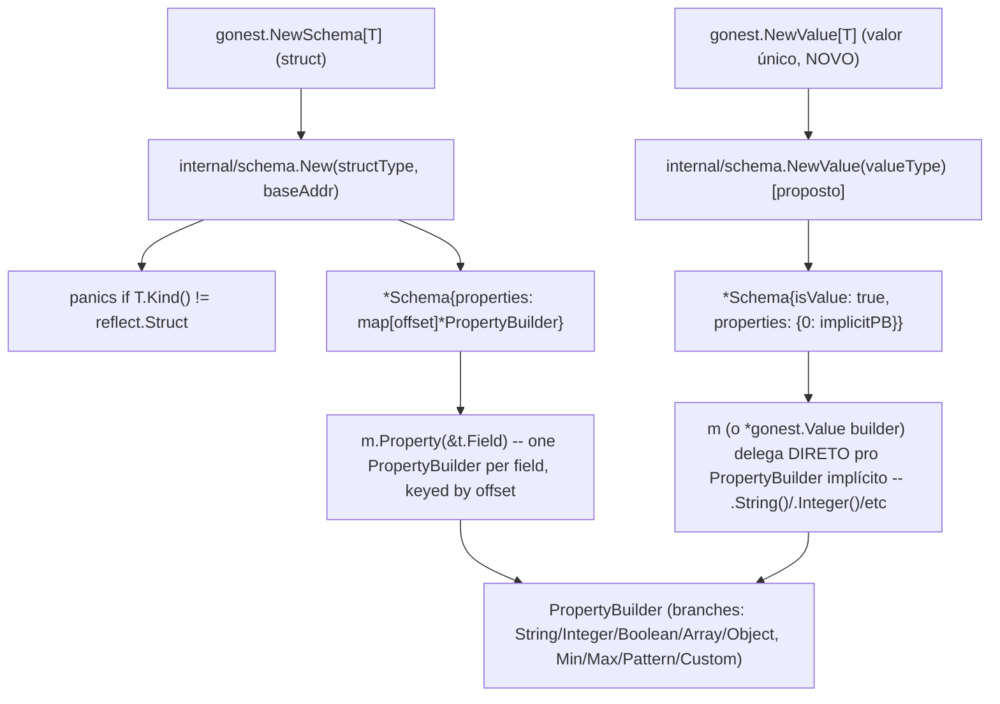

# Schema Value Support Design

**Spec**: `.specs/features/schema-value-support/spec.md`
**Context**: `.specs/features/schema-value-support/context.md`
**Status**: Draft

---

## Architecture Overview

`PropertyBuilder` já é auto-suficiente hoje -- carrega `kind`/`min`/`max`/
`pattern`/`custom`/etc sem depender de nada do `Schema` que o contém (ver
`internal/schema/schema.go`'s `PropertyBuilder` struct, linhas 159-189).
Isso é o que torna a feature viável sem duplicar lógica: um `Value` só
precisa produzir UM `PropertyBuilder` "solto" (sem os outros N-1 campos de
uma struct ao redor) e reaproveitar tudo que já existe para validá-lo.

---

## Code Reuse Analysis

### Existing Components to Leverage

| Component | Location | How to Use |
| --------- | --------- | ---------- |
| `PropertyBuilder` (branches String/Integer/Boolean/Array/Object + Min/Max/Pattern/Custom) | `internal/schema/schema.go`, `string.go`, `numeric.go`, `array.go`, `object.go` | Reusado sem NENHUMA mudança -- `Value` só precisa devolver o MESMO `*PropertyBuilder` que `Property()` já devolve hoje |
| `validateValue`/`validatePrimitive`/`validateArray`/`validateObject` | `internal/validate/validate.go` | Reusados sem mudança -- operam sobre um `*PropertyBuilder` + `raw any`, nunca inspecionam o `*Schema` pai diretamente |
| `resolveSchema` | `internal/validate/validate.go` | Precisa aceitar `structType` sendo o próprio tipo primitivo (`reflect.TypeOf("")`), não só struct -- checar se já funciona ou precisa de ajuste mínimo |
| `Parseable`/`gonest.Parse[T]`/`MustParse[T]` | `internal/execution`, `gonest.go` (unified-parse-api) | Zero mudança -- `ParseInto(dst any, schema any)` já aceita `dst` como qualquer ponteiro |
| `internal/value.Value[T]` (Get/Set/IsDirty/OnDirty/Apply/MarshalJSON/UnmarshalJSON/ToDirtyMap) | `internal/value/value.go` | Renomeado por inteiro para `Accessor[T]` -- mecânico, mesma implementação |

### Integration Points

| System | Integration Method |
| ------ | ------------------- |
| `internal/schema` | Ganha um segundo modo de construção (`NewValue`/`isValue` flag, ou tipo irmão -- decisão de Tasks) que produz `*Schema` com exatamente 1 `PropertyBuilder` implícito (offset 0) em vez de escanear campos de struct |
| `gonest.go` | `NewValue[T any](fn func(m *Value)) *Schema` novo (wrapper, mesma razão AD-004 de `NewSchema[T]` já ser wrapper -- Go não re-exporta função genérica via `var`); `type Value = schema.Value` (ou nome equivalente) alias |
| `internal/value` → renomeado | `Value[T]` → `Accessor[T]`, arquivo `value.go` provavelmente também renomeia para `accessor.go` (a confirmar em Tasks) |
| `internal/validate` | `resolveSchema`'s `structType != m.StructType()` check precisa continuar válido quando `m.StructType()` é um tipo primitivo em vez de struct -- verificar se `reflect.Type` comparison já funciona igual (deveria, já que `reflect.Type` é comparável para qualquer Kind) |

---

## Components

### `Value` (new type -- `internal/schema`, nome exato a definir em Tasks)

- **Purpose**: Builder para um schema de valor único (sem struct em volta). Expõe os MESMOS branches de tipo que `PropertyBuilder` (`String()`, `Integer()`, `Boolean()`, etc).
- **Location**: `internal/schema/value.go` (novo arquivo, mesmo padrão de `string.go`/`numeric.go`/`array.go`/`object.go` -- um arquivo por branch-family)
- **Interfaces**:
  - Provavelmente `type Value = PropertyBuilder` (alias direto) SE `PropertyBuilder` já expõe tudo que se precisa -- a decidir em Tasks se vale a pena um tipo novo ou se um alias resolve com zero código extra
- **Dependencies**: `PropertyBuilder` (reuso total)
- **Reuses**: Toda a lógica de branch (`String`/`Integer`/`Boolean`/`Min`/`Max`/`Pattern`/`Custom`) já implementada

### `NewValue[T]` (new function -- `gonest.go`)

- **Purpose**: Wrapper genérico público (Go não permite re-exportar função genérica via `var` -- AD-004), espelha `NewSchema[T]` mas sem o parâmetro `t *T`.
- **Location**: `gonest.go`, seção `// Schema` existente
- **Interfaces**: `func NewValue[T any](fn func(m *Value)) *Schema`
- **Reuses**: Mesmo padrão de wrapper que `NewSchema[T]` já usa

### `Accessor[T]` (renamed from `Value[T]` -- `internal/value`)

- **Purpose**: Idêntico ao `Value[T]` de hoje -- dirty-tracking field wrapper. Só o nome muda.
- **Location**: `internal/value/value.go` (ou renomeado pro arquivo, a confirmar)
- **Interfaces**: Idênticas -- `Get()`, `Set()`, `IsDirty()`, `OnDirty()`, `Apply()`, `MarshalJSON()`, `UnmarshalJSON()`, `New()`
- **Reuses**: 100% do código existente, rename mecânico

---

## Tech Decisions

| Decision | Choice | Rationale |
| -------- | ------ | --------- |
| `Value` é um tipo novo ou um alias de `PropertyBuilder`? | A decidir em Tasks -- `PropertyBuilder` já tem tudo (`String`/`Integer`/etc), então um alias (`type Value = PropertyBuilder`) pode ser suficiente e evita duplicar método nenhum. Só vale um tipo novo se precisar de comportamento DIFERENTE de `PropertyBuilder` em algum ponto (ainda não identificado) | Minimiza código novo, reaproveita 100% da engine existente |
| `internal/schema.New` ganha um flag `isValue`, ou um construtor SEPARADO (`NewValue`)? | A decidir em Tasks -- `New(structType, baseAddr)` hoje PANICA se `structType.Kind() != reflect.Struct` (linha 38-40 de `schema.go`); um construtor separado evita mexer nessa validação existente, reduzindo risco de regressão no caminho já usado por toda struct existente | Menor superfície de mudança em código já testado e em uso |
| Rename do arquivo `internal/value/value.go` | A confirmar em Tasks se vale renomear o ARQUIVO junto com o TIPO, ou só o tipo dentro do arquivo existente | Cosmético, baixo risco de qualquer escolha |

---

## Error Handling Strategy

| Error Scenario | Handling | Caller Sees |
| -------------- | -------- | ----------- |
| `NewValue[T]` chamado com `T` não suportado por nenhum branch (ex: um struct complexo, que deveria usar `NewSchema[T]` em vez disso) | A definir -- provavelmente sem validação em `NewValue` em si (o branch method, ex: `.String()`, já falha/nunca é chamado corretamente se o dev usar o construtor errado -- comportamento a confirmar em Tasks) | Erro de programador, categoria "coding error", não request-validation |
| Schema mismatch (`resolveSchema`) para um `Value`-based schema | MESMO panic que já existe hoje para struct (`resolveSchema`'s `m.StructType() != structType` check) | Panic com mensagem "gonest: schema mismatch" -- comportamento já testado, só precisa continuar valendo quando `StructType()` é primitivo |
