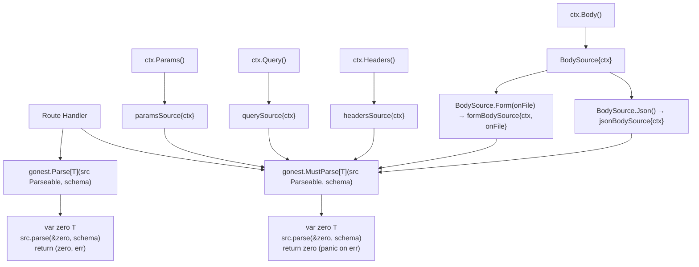

# Unified Parse API Design

**Spec**: `.specs/features/unified-parse-api/spec.md`
**Context**: `.specs/features/unified-parse-api/context.md`
**Status**: Draft

---

## Architecture Overview

`Parse[T]` and `MustParse[T]` are source-agnostic. Each `ctx` method returns a concrete
`Parseable` implementation that knows exactly how to read and validate its own source.

---

## Code Reuse Analysis

### Existing Components to Leverage

| Component | Location | How to Use |
| --------- | --------- | ---------- |
| `resolveSchema` | `internal/validate/validate.go` | Unchanged — called first inside each `parse()` impl to guard against schema-type mismatch |
| `violation`, `tagKeyVisible` | `internal/validate/validate.go` | Reused as-is — `headersSource.parse` adds `tagKeyVisible(p.Field(), "header")` as its new tag name |
| `validateValue` | `internal/validate/validate.go` | Reused unchanged for field-level constraint checking in headers/params/query |
| `ParseRestParams` internal logic | `internal/validate/params.go` | Extracted into a shared helper; `paramsSource.parse` calls it |
| `ParseRestQuery` internal logic | `internal/validate/query.go` | Same extraction pattern as params |
| `ParseRestJsonBody` internal logic | `internal/validate/validate.go` | Same extraction pattern — `jsonBodySource.parse` delegates to it |
| `ParseRestFormBody` internal logic | `internal/validate/form.go` | `formBodySource.parse` delegates; holds `onFile` in struct field |
| `exception.NewBadRequestException` | `internal/exception/builtin.go` | Same violation-collecting shape, unchanged |
| `ctx.Header(name)` | `internal/execution/context.go` | `headersSource.parse` calls this per field — no Fiber dependency added to validate |
| `ctx.Param(name)`, `ctx.Queries()` | `internal/execution/context.go` | Already used by params/query internals; untouched |
| AD-004 wrapper pattern | `gonest.go` | `Parse[T]`/`MustParse[T]` are real wrappers (Go cannot re-export generics via var) |

### Integration Points

| System | Integration Method |
| ------ | ------------------ |
| `internal/execution.Context` | Gains `Params() Parseable`, `Query() Parseable`, `Headers() Parseable`, `Body() BodySource`, `RawBody() []byte`; loses `Body() []byte` |
| `internal/execution.Responder` | `Body() []byte` renamed to `RawBody() []byte` — every implementer (real Fiber adapter + test fakes) must be updated |
| `gonest.go` public API | `Parse[T]` / `MustParse[T]` added; 8 legacy wrappers removed |
| `internal/validate` | New `Parseable` interface + 5 source structs; 8 legacy exported functions removed |

---

## Components

### `Parseable` (new interface — `internal/validate/validate.go`)

- **Purpose**: The single contract every HTTP data source must satisfy. Carries its own parse logic alongside the state needed to execute it (ctx, onFile, etc.).
- **Location**: `internal/validate/validate.go`
- **Interfaces**:
  - `parse(dst any, m *Schema) error` — unexported; only types in `internal/validate` can implement it
- **Dependencies**: `*Schema` (already imported)
- **Reuses**: nothing — this is the new leaf type

### `paramsSource` (new struct — `internal/validate/params.go`)

- **Purpose**: `Parseable` implementation for route path params. Delegates to the existing internal params-parse logic extracted from `ParseRestParams[T]`.
- **Location**: `internal/validate/params.go`
- **Interfaces**:
  - `parse(dst any, m *Schema) error` — reads path params via `param:` struct tag
- **Dependencies**: `*execution.Context` (already imported in this file)
- **Reuses**: extracted helper from current `ParseRestParams[T]` body

### `querySource` (new struct — `internal/validate/query.go`)

- **Purpose**: `Parseable` implementation for URL query string.
- **Location**: `internal/validate/query.go`
- **Interfaces**:
  - `parse(dst any, m *Schema) error` — reads query params via `query:` struct tag
- **Dependencies**: `*execution.Context`
- **Reuses**: extracted helper from current `ParseRestQuery[T]` body

### `jsonBodySource` (new struct — `internal/validate/validate.go`)

- **Purpose**: `Parseable` implementation for JSON request body.
- **Location**: `internal/validate/validate.go`
- **Interfaces**:
  - `parse(dst any, m *Schema) error` — reads raw body via `json:` struct tag
- **Dependencies**: `*execution.Context`
- **Reuses**: extracted helper from current `ParseRestJsonBody[T]` body

### `formBodySource` (new struct — `internal/validate/form.go`)

- **Purpose**: `Parseable` implementation for `multipart/form-data` body. Holds the `onFile` callback alongside the context.
- **Location**: `internal/validate/form.go`
- **Interfaces**:
  - `parse(dst any, m *Schema) error` — streams multipart parts; invokes `onFile` on file parts; collects field violations
- **Dependencies**: `*execution.Context`, `onFile func(*FormFile) error`
- **Reuses**: extracted helper from current `ParseRestFormBody[T]` body
- **Special**: `onFile == nil` → file parts are silently ignored (no panic)

### `headersSource` (new struct — `internal/validate/validate.go` or `headers.go`)

- **Purpose**: `Parseable` implementation for HTTP request headers. Net-new capability.
- **Location**: `internal/validate/validate.go` (or extracted to `headers.go` if file grows too large)
- **Interfaces**:
  - `parse(dst any, m *Schema) error` — reads headers via `header:` struct tag using `ctx.Header(name)`
- **Dependencies**: `*execution.Context`
- **Reuses**: `tagKeyVisible`, `validateValue`, `violation`, `exception.NewBadRequestException` — same pattern as `querySource`

### `BodySource` (new struct — `internal/execution/context.go`)

- **Purpose**: Intermediate type returned by `ctx.Body()`. Exposes `.Json()` and `.Form(onFile)` so the body format is explicit and autocomplete-discoverable.
- **Location**: `internal/execution/context.go`
- **Interfaces**:
  - `Json() Parseable` — returns a `jsonBodySource`
  - `Form(onFile func(*FormFile) error) Parseable` — returns a `formBodySource`
- **Dependencies**: `jsonBodySource`, `formBodySource` from `internal/validate`
- **Note**: `BodySource` lives in `internal/execution` but holds `Parseable` values from `internal/validate`. This is fine — `execution` already does NOT import `validate` directly today, so `BodySource.Json()` / `BodySource.Form()` will need to either (a) accept the source structs as `any` and type-assert, or (b) have `execution` import `validate`. Option (b) must be checked for import cycles first.

> **Import cycle check (CRITICAL):** Today `internal/validate` imports `internal/execution` (to receive `*execution.Context`). If `internal/execution` were to import `internal/validate` back (to construct `jsonBodySource`/`formBodySource` inside `BodySource`), that would be a direct cycle.
>
> **Resolution**: `BodySource` does NOT construct the source structs itself. Instead, it holds a reference back to `*execution.Context` and exposes factory methods that the caller (`ctx.Body().Json()`) will use — but the actual construction of `jsonBodySource{ctx}` / `formBodySource{ctx, onFile}` happens in `gonest.go`'s `Parse[T]` / `MustParse[T]` or in a thin adapter layer. **Alternative**: `BodySource` is defined in `internal/validate` alongside the source structs (not in `internal/execution`), and `ctx.Body()` in `execution` returns a `validate.BodySource`. This is cleaner and avoids any cycle — `execution` imports `validate` zero times today and would not need to start. `validate` already imports `execution`, so `validate.BodySource{ctx: ctx}` is fine. `ctx.Body()` in `execution/context.go` returns a `validate.BodySource` type — same one-way dependency direction that already exists.
>
> **Final decision**: `BodySource` lives in `internal/validate`. `ctx.Body()` in `execution/context.go` returns `validate.BodySource`. `execution` gains a new import of `validate` — need to confirm this doesn't create a cycle (execution → validate → execution would be a cycle). Since `validate` imports `execution` today, `execution` importing `validate` back IS a cycle. **Correct resolution**: introduce a minimal `internal/parsesource` package (or place `BodySource` + `Parseable` in a new `internal/parse` package) that neither `execution` nor `validate` imports from each other. `execution` imports `parse`, `validate` imports `parse`. This is the cycle-safe design.
>
> **Simpler alternative confirmed**: Keep `BodySource` as a dumb struct with NO imports of `validate` at all — it stores only the raw `[]byte` (from `ctx.RawBody()`) and the `FormStream()` result alongside the `onFile` callback, all as primitive types/interfaces already present in `execution`. Then `Parse[T]` in `gonest.go` (which CAN import both `execution` and `validate`) inspects the `Parseable` concrete type and routes accordingly. But this breaks the "source carries its own parse function" architecture principle from the spec.
>
> **Adopted resolution (cleanest)**: Move `Parseable` interface definition to `internal/execution` (where `Context` already lives — it's the natural owner since every source wraps a `*Context`). `internal/validate` imports `internal/execution` (already does) and implements `Parseable` from `execution`. `gonest.go` re-exports `Parseable` as a type alias. No new package needed. `BodySource` lives in `internal/execution` and returns concrete `validate.XxxSource` values — wait, that still cycles. **Truly final**: `Parseable` interface and `BodySource` both live in `internal/execution`. `BodySource.Json()` / `BodySource.Form()` return `Parseable` but the concrete type is provided by `validate` at construction time — `ctx.Body()` in `execution/context.go` returns a `BodySource` whose `Json`/`Form` fields are function closures (`func() Parseable`) set by whoever calls `Context.WithBodySource(bs BodySource)`. `gonest.go` wires this in. **This is getting complex — see Tech Decisions below for the adopted approach.**

### `Parse[T]` / `MustParse[T]` (new functions — `gonest.go`)

- **Purpose**: The two public generic entry points. Source-agnostic. Declare `var zero T`, call `src.parse(&zero, schema)`, return.
- **Location**: `gonest.go` — new section replacing the legacy `// Validation` section
- **Interfaces**:
  - `Parse[T any](src Parseable, m *Schema) (T, error)`
  - `MustParse[T any](src Parseable, m *Schema) T`
- **Dependencies**: `Parseable` type (re-exported), `*Schema`
- **Reuses**: AD-004 wrapper pattern; `resolveSchema` check (inside each source's `parse`)

---

## Tech Decisions

| Decision | Choice | Rationale |
| -------- | ------ | --------- |
| Where does `Parseable` interface live? | `internal/validate/validate.go` | It's the package that provides all concrete implementations. `gonest.go` re-exports it as a type alias (`type Parseable = validate.Parseable`) following the same pattern as `type Schema = schema.Schema`. |
| Import cycle for `BodySource` | `BodySource` lives in `internal/validate`; `ctx.Body()` in `execution/context.go` returns `validate.BodySource` — BUT this creates `execution → validate` which combined with `validate → execution` is a cycle. **Resolution**: `ctx.Body()` does NOT return `validate.BodySource` directly. Instead, `BodySource` is defined in `internal/execution` as a thin struct holding only a `*Context` reference. Its `.Json()` and `.Form()` methods are satisfied by setting two unexported function fields (`jsonFn func() Parseable`, `formFn func(*FormFile) error → Parseable`) which are populated by `gonest.go`'s wiring layer — same "opaque carrier" trick `Context.WithRoute(any)` already uses to avoid import cycles (see `context.go` line 71 and STATE.md L-004). | Avoids new package, avoids cycle, reuses established pattern from this codebase. |
| Where does `ctx.Params()` / `ctx.Query()` construction happen? | Inside `internal/execution/context.go` — but they cannot reference `paramsSource`/`querySource` directly (cycle). Resolution: same wiring pattern as `BodySource` — `ctx.Params()` returns a `Parseable` stored as a field (set during route dispatch by `internal/route`, which already imports both `execution` and `validate`). | `internal/route` already bridges `execution` and `validate`; it's the right place to wire sources to context. |
| `headersSource` tag name | `header:"name"` | Consistent with `param:"..."`, `query:"..."`, `form:"..."`, `json:"..."`. |
| `onFile == nil` behavior | Silently skip file parts | Panicking on nil would punish handlers that have no file fields; silent skip is the safe default. |
| Removing legacy at same time as adding new | Yes, single operation | User opted for immediate removal. No co-existence period. |

---

## Error Handling Strategy

| Error Scenario | Handling | Caller Sees |
| -------------- | -------- | ----------- |
| Required header/param/query/field missing | Collected into `*BadRequestException` | HTTP 400 with all violations |
| JSON parse error (malformed body) | `*BadRequestException` | HTTP 400 |
| Schema built for wrong type `T` | `panic(string)` via `resolveSchema` | Startup-time panic (coding error) |
| `Form()` called without `EnableFormStreaming` or wrong `Content-Type` | `panic(string)` | Startup/config error, same as current `ParseRestFormBody` |
| `onFile` returns a non-nil error | Collected into `*BadRequestException` | HTTP 400 |
